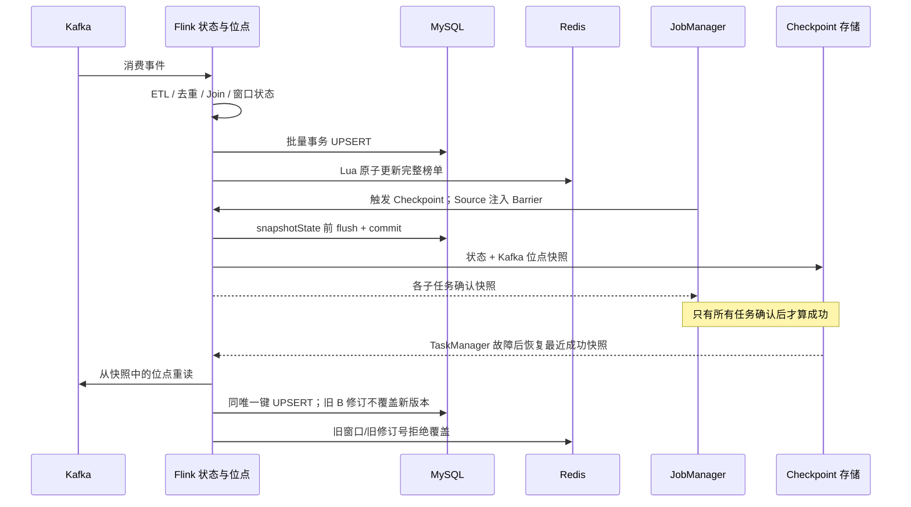

# 第 5 天：外部存储与恢复

## 处理链路

原始 Topic -> Schema ETL -> `event_id` 去重(24h TTL) -> 各自 Watermark
-> 时序 ETL(首版发布下界)与 Join(文章 2h TTL、先到立即旁路、迟到仍重关联)
-> 规则 A/B/C -> MySQL 与 Redis。常驻作业不需要 `--bounded`；
它只供固定批次验收自动结束并推进终止水位线。常驻作业在真实后续事件
推进 Watermark 后关窗；完全停更时尚未关闭的窗口不能伪称最终结果，
应查询预览或单独做有界回放。不要注入虚假的未来事件时间以强制关窗。

`Day5SinkJob`：共用一次 ETL/Join 和去重后的流，同时送四张 MySQL 明细/规则表、
可查询的异常表与 Redis 最新榜单。`Day5MySqlSink`：五类输出共用 JDBC
批量 UPSERT，每 200 行或 Checkpoint 前提交；失败回滚并由 Flink 重试。
提交作业时可使用 `--mysql-batch-size 100` 覆盖批量阈值（1..10000），
仅调整 Sink 写批，状态描述符、拓扑与 Kafka 消费组不变。
`Achieve_roleB.RuleStreams`：排名主流和文章得分阶段的超期输入同时暴露，
供独立运行打印日志或共用 Sink 作业落库。
规则 B 第一阶段超期原始行为记录为 `ROLE_B_LATE_INPUT`，排名阶段的超期
文章得分记录为 `ROLE_B_LATE`；都写入异常表供后续核对/离线补算，
不能将进入异常表误认为已经完成补算。
`Day5RedisRankSink`：只接收规则 B 的 rank 1 所携整份 Top 5，Lua 比较
窗口与修订号后原子写入 `hotnews:top5:latest`，2 小时失效。
`ArticleJoinBehavior.BehaviorDeduplicate`：清洗后、Join 前按事件 ID 去重；
`RoleStreamUtil` 在规则入口继续做二次幂等保护。
Docker 不可用时可执行 `Day5SinkJob --plan` 只构建作业图，
不把它当作 MySQL/Redis 写入或故障恢复通过的证据。

`--bounded` 不是生产窗口计算的前提：连续流收到足够晚的后续事件，
Watermark 就会正常关窗；分区空闲检测避免停更分区拖住活跃分区。
若整条流都不再产生新事件，可用处理时间定时器提供**暂定预览**，
但可能被后到事件修正；需要可证明的最终窗口时，使用上游明确的
批次结束信号/终止水位线，或隔离 Topic 的有界回放验收。
不能因为进程准备停止，就把尚未关闭的事件时间窗口直接标为最终结果。

## 参数和一致性

Checkpoint：10 秒间隔、60 秒超时、2 秒最小间隔、最多一个并发、允许三次
连续失败。10 秒兼顾 200 行写批与恢复间隔；若 MySQL 写批/反压导致超时，
先记录 Web UI 的对齐、总时长和失败原因再调参。JobManager 与 TaskManager
共享 `file:///opt/flink/checkpoints/day5` 和 `/opt/flink/savepoints` 路径；
对应的宿主机目录为 `D:\docker_data\flink\checkpoints` 和 `D:\docker_data\flink\savepoints`，
由 Compose 绑定挂载，
取消作业时保留外部 Checkpoint；3 次失败后间隔 5 秒重启。

Kafka 位点与 Flink 状态随成功 Checkpoint 一起恢复，但 JDBC/Redis 不参加
Flink 分布式事务。时序：

```text
Kafka 消费 -> 规则状态变更 -> MySQL 批量事务提交 / Redis 原子快照
           -> Checkpoint Barrier 对齐 -> Sink 快照前 flush -> 状态快照成功
失败重启   -> 恢复上次成功快照及 Kafka 位点 -> 重放未确认事件
           -> MySQL 相同唯一键 UPSERT / Redis 拒绝旧窗口及旧修订号
```

因此外部存储是**至少一次写入 + 幂等最终收敛**，不是跨 MySQL/Redis 的
原子 Exactly-Once。MySQL `event_id`、(窗口起点,文章 ID)、
(窗口起点,名次)、(告警分钟,IP) 与 (异常类型,事件 ID) 分别为唯一键，
没有 `count=count+1`。A 累积点击数取较大值；B 同一窗口的总分
`revision` 单调递增，旧重放不覆盖新排名。Redis 一次存完整榜单，
同窗口旧修订号拒绝覆盖。重放期间 MySQL 多表并不具备同一时刻的一致快照，
需等待追平后再作最终核验。C 的撤销写 `retracted=true`，查询时过滤。

### 一页一致性边界与时序

独立交付页见 [`05-Day5-一致性边界.md`](05-Day5-一致性边界.md)。



Flink 的 Exactly-Once 只覆盖由成功快照一起恢复的 Flink 状态和 Kafka
消费位点；MySQL/Redis 均不参加该事务，故障点若位于外部写入成功、
快照完成之前，恢复后会再写一次。MySQL 主键与 UPSERT 防止行数累加；
规则 A 的点击数取较大值，规则 B 的同窗口排名按单调 `revision`
拒绝旧版本。Redis Hash 包含 `window_start_ms`、`window_end`、
`revision` 和完整 `ranking` JSON；Lua 比较窗口和修订号后一次写入，
TTL 为 7200 秒。Redis 键过期后没有跨过期的版本记忆，必须等待回放
追平再比较最终榜单；MySQL 多表也没有跨 Sink 的原子可见性。
Checkpoint 是自动、频繁的故障恢复点；Savepoint 是显式创建、
用于有计划的停机与恢复的状态快照。恢复时保持拓扑、状态序列化和
消费组不变；不能把批量阈值变化说成状态 schema 升级。

## Docker 启动与核验

先安装并启动 Docker Desktop；本机安装的命令行与容器可用性须现场确认。
项目根目录执行（已有 `.env` 时不覆盖，修改口令后再启动）：

```powershell
if (-not (Test-Path deploy/.env)) { Copy-Item deploy/.env.example deploy/.env }
mvn -o -f flink-job/pom.xml -pl flink-rolesachieve -am package
docker compose --env-file deploy/.env -f deploy/docker-compose.yml config
docker compose --env-file deploy/.env -f deploy/docker-compose.yml up -d
powershell -ExecutionPolicy Bypass -File deploy/create-kafka-topics.ps1
docker compose --env-file deploy/.env -f deploy/docker-compose.yml exec jobmanager `
  flink run -d -c Day5SinkJob /opt/flink/usrlib/flink-rolesachieve-1.0-SNAPSHOT-all.jar
```

MySQL 首次初始化自动执行 `sql/01-day5-tables.sql`；已有数据卷必须手动
执行该 SQL，**不要**用 `down -v` 清库。随后在 MySQL 执行
`sql/queries/day5-check.sql`；查询原始数据并确认没有混入多批消息。
固定 seed 的目标：清洗明细 97044、A 123、B 60、C 活跃告警 0。
MySQL 已有旧版同名表时，先检查表结构是否包含 `category_rank.revision`，
缺失则执行 `ALTER TABLE category_rank ADD COLUMN revision BIGINT NOT NULL DEFAULT 0`，
不要期待 `CREATE TABLE IF NOT EXISTS` 修改现有表。
Redis 用 `docker compose ... exec redis redis-cli HGETALL hotnews:top5:latest`
查询 `ranking` JSON 数组、`revision` 和 `window_start_ms`，还需检查 TTL。
有界验收可只在隔离 Topic/消费组执行 `Day5SinkJob --bounded`，不要在
同一生产 MySQL 上同时运行常驻和回放作业，以免两个作业互相写旧窗口。

## 故障与 Savepoint 操作

1. Flink Web UI（默认 `http://localhost:8081`）记录 Job ID、最新成功的
   Checkpoint ID/时长、Kafka Lag、上面 SQL 计数与 Redis 修订号。
2. `docker compose --env-file deploy/.env -f deploy/docker-compose.yml kill taskmanager`
   模拟 TaskManager 故障；Kafka 保留原消息，不删除卷。观察作业重启，
   `docker compose --env-file deploy/.env -f deploy/docker-compose.yml up -d taskmanager`。
   再核对最新成功 Checkpoint、消费追平、四表行数和 Redis JSON。
3. 在 JobManager 上执行 `flink savepoint <job-id> file:///opt/flink/savepoints`
   并记录实际返回的 Savepoint 路径；`flink cancel <job-id>` 后，将
   提交时将 `--mysql-batch-size 100` 传给主类，再执行
   `flink run -s <实际 Savepoint 路径> -d -c Day5SinkJob <同一 JAR 路径> --mysql-batch-size 100`。
   只改批量阈值；不要随意改状态描述符、算子拓扑、序列化格式或 Kafka 消费组。
4. 重试模拟：同一固定 Topic 再从旧 Checkpoint/Savepoint 回放，
   检查唯一键行数、A 点击数、B `revision`、Redis 榜单和异常未解决记录。
   若有 SQL/Flink 差异、Checkpoint 失败或 Redis 回退，保存原始日志，
   不以“作业 RUNNING”冒充验收成功。

当前终端无 Docker CLI，但 Docker Engine 命名管道及 Kafka/MySQL/Redis/Flink
服务均可用；`tests/day5/docker-engine.mjs` 提供对该 Compose 栈的定向
`ps`、`exec`、`kill taskmanager`、`start taskmanager` 操作。
实际验收的 Job ID、检查点和外部存储证据见 `tests/day5/README.md`
及 `tests/day5/evidence/`，其中是否恢复成功应以**新成功的 Checkpoint**
和所有算子运行、结果核对为准。

## 本机检查（2026-10-05）

`mvn -o -f flink-job/pom.xml -pl flink-rolesachieve -am package`：
20 项 Java 测试通过；Node 独立 SQL 3 项通过。`Day5SinkJob --plan`
构建 38 个图节点，包含五个 MySQL Sink 和一个 Redis Sink；打包 JAR
含 MySQL Connector/J 和 Jedis。SnakeYAML 静态解析 Compose 得到六个服务
及容器侧 Kafka/MySQL/Redis 环境变量。固定 Kafka 批次核对 ETL 去重后的
Join=97044，A=123、B=60、C=0；B 完整快照复验 60 行逐窗口无差异。
上述结果不包含任何实际 MySQL/Redis 写入、Checkpoint 恢复或 Savepoint 演练；
这些需要有 Docker 的环境后补足原始指标与日志。

## 现场实测（2026-10-06）

本轮真实 Kafka/Flink/MySQL/Redis 指标、TaskManager Kill 与 Savepoint
恢复路径、重放幂等比对见 [`../tests/day5/README.md`](../tests/day5/README.md)；
REST 与 Redis 恢复已通过，恢复后的 MySQL 宿主机查询仍需提供可用的
账号/口令及宿主机访问权限才能完成。测试探针用 MySQL 临时表和 Redis 独立 Key，
不会修改业务数据。若凭据不一致，**不要**将 MySQL 探针失败解释为
业务 Sink 失败，也不要宣称外部结果已完成全部核验。
