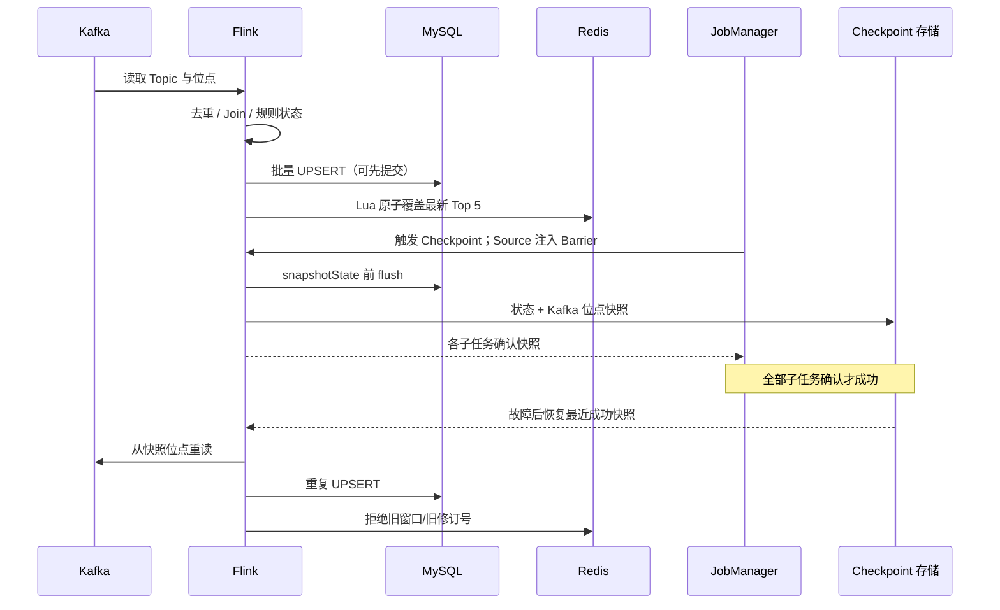

# Day 5：Kafka、Flink、MySQL、Redis 一致性边界

| 环节 | 保证 | 边界与核验 |
| --- | --- | --- |
| Kafka + Flink | 成功 Checkpoint 同时记录消费位点与算子状态；从快照恢复后重新消费未确认输入。 | 只保证 Flink 状态及位点的一致性；没有成功快照时不能只看 `RUNNING`。 |
| MySQL | `event_id` 或窗口业务键唯一，批量事务提交；A `GREATEST` 不累加，B `revision` 阻止旧值覆盖。 | 不参与 Flink 事务，外部写入先于快照时会重试。多表不提供同步快照；C 的撤销需查询 `retracted=0`。 |
| Redis | 一个 Hash 存窗口、修订号、完整 JSON 榜单；Lua 同时检查版本并更新，TTL 7200 秒。 | 与 MySQL 不原子；Key 过期会丢失版本记忆。重放后须追平并核对最新榜单。 |
| 恢复 | Checkpoint 自动周期性生成；Savepoint 手动生成，用于有计划的恢复。 | 批大小 200 改 100 不影响状态；状态描述符、序列化器、算子拓扑、Kafka 消费组不可随意修改。 |

结论：外部存储为**至少一次写入 + 业务幂等最终收敛**，不是
Kafka/Flink/MySQL/Redis 的跨系统原子 Exactly-Once。固定批次验收应在
无并发写入时核对 MySQL A/B/C 与 Redis，并记录最新成功 Checkpoint、
实际 Savepoint 路径和恢复前后逐键差异。
