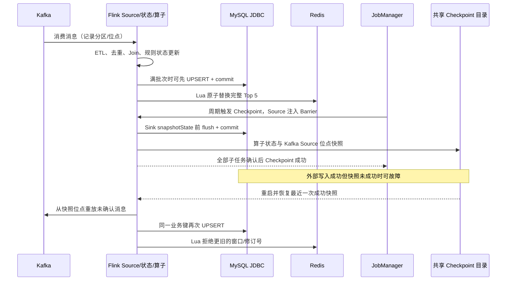

# Day 5：Kafka、Flink、MySQL、Redis 一致性边界（一页）

| 层 | 已有保证 | 不能承诺的边界 |
| --- | --- | --- |
| Kafka + Flink | 成功 Checkpoint 保存 Source 位点和去重、Join、规则状态；故障后重放尚未随成功快照确认的输入。 | `RUNNING` 不等于恢复完成；要看到所有顶点运行且产生新成功快照。处理时间 TTL 到期后不保证跨任意久的事件 ID 去重。 |
| MySQL | JDBC 每 200 行或快照前批量事务提交；明细 `event_id`、A `(窗口,文章)`、B `(窗口,名次)`、C `(分钟,IP)`、异常 `(类型,事件)` 为主键。A `GREATEST` 避免累加，B 以 `revision` 拒绝旧版。 | 不参与 Flink 事务；多表间不是原子快照。C 撤销 `retracted=1`，现有 C 没有版本保护，任意旧 Checkpoint 回放可能覆盖新撤销；查询活跃 C 要过滤撤销。 |
| Redis | Hash `hotnews:top5:latest` 存 `window_start_ms`、`window_end`、`revision`、完整 `ranking` JSON；Lua 比较窗口/修订号后一次替换，TTL 7200 秒。 | 与 MySQL 不原子；Key 过期即丢失版本记忆，过期后旧窗口可能写入；同版本重写会刷新 TTL。 |
| Savepoint | 显式快照，可在取消旧 Job 后用同一拓扑和消费组、只改 JDBC 批大小从 200 到 100 恢复。 | 状态名/类型、序列化器、拓扑/算子身份、Kafka 消费语义不能随意改；是否兼容要以实际恢复和后续成功快照验证。 |

**结论**：本项目的 Exactly-Once 限于成功快照约束下的 Flink 状态和
Kafka Source 位点；MySQL/Redis 是**至少一次外部写入 + 业务键幂等
（有边界的最终收敛）**，绝非四系统跨库原子 Exactly-Once。
外部提交早于快照成功时，恢复必然可能重写。验收须停掉并发写入，
等待 Source 追平，逐键核对 A/B、C 活跃/撤销、Redis 完整榜单与版本，
并保留故障前后快照与新成功 Checkpoint 证据。
详见 [操作命令](04-Day5-Sink与恢复验收.md) 和
[实测/待验记录](06-Day5-Checkpoint与Savepoint记录.md)。
