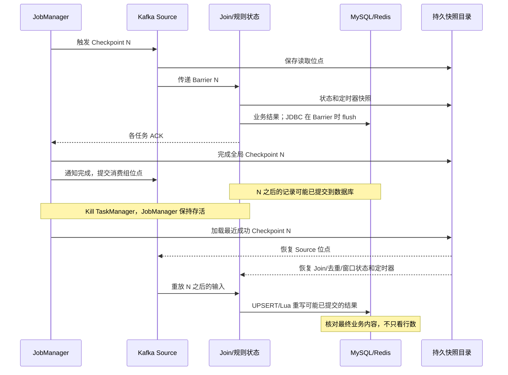

# 故障演练与恢复 SOP

## 概念说明

Checkpoint 是运行期间自动生成的一致快照，记录 Kafka Source 位点、Join 缓存、去重状态、窗口累计值和定时器。TaskManager 故障后，存活的 JobManager 协调任务从最近一次成功 Checkpoint 恢复；恢复点之后的输入可能再次处理。Checkpoint 不是 MySQL 或 Redis 的备份，也不包含外部数据库回滚。

Savepoint 是主动触发、由使用者管理的恢复点，适合计划停机和修改配置后重新提交。创建 Savepoint 本身不会暂停作业。这里使用普通 Savepoint 后取消作业，恢复它之后处理 Savepoint 之后的 Kafka 数据。不要使用 `stop --drain`：它会推进终止 Watermark，改变窗口输出，不适合这次保持实时窗口状态的演练。

IDEA 的 MiniCluster 通常把 JobManager 和 TaskManager 放在一个 JVM 内。结束 IDEA 进程不能替代“JobManager 存活、单独 Kill TaskManager”的考核。正式演练使用项目 Docker Standalone Session 集群，Web UI 为 http://localhost:8081。

## 项目中的具体实现

入口为 `com.agd.flink.roles.roleall.Achieve_roleAll`，统一 Join 后运行 A/B/C；故障正确性实验保持 RocksDB、Join 盐数 8、并行度 3、事件时间和当前允许迟到时间不变。

代码显式设置 Checkpoint 间隔 30 秒、超时 180 秒、最小间隔 2 秒、并发 1、失败容忍 3 次。本轮首次运行固定延迟重启 3 次、间隔 5 秒；首次 Kill 失败后，统一入口已覆盖为重启 3 次、间隔 30 秒，其他入口继续沿用公共配置。取消后保留外置 Checkpoint，但更旧的 Checkpoint 仍可能被保留策略清理。程序设置优先于 YAML 中同名默认值；仅改 `deploy/flink-conf.yaml` 的超时不能认为程序的 180 秒已经被覆盖。

Docker 挂载路径：

| 容器路径 | Windows 路径 | 用途 |
| --- | --- | --- |
| `/opt/flink/checkpoints` | `D:\docker_data\flink\checkpoints` | JobManager/TaskManager 都可读写的持久快照 |
| `/opt/flink/savepoints` | `D:\docker_data\flink\savepoints` | 人工恢复点 |
| `/opt/flink/rocksdb` | `D:\docker_data\flink\rocksdb` | TaskManager 本地工作状态，不能当成恢复快照 |

### 开始前的准备检查

以下是 2026-10-08 检查到的实际准备项，尚未修改或验收：

1. `deploy/docker-compose.yml` 的 JobManager 和 TaskManager 都需要配置 `HOTNEWS_STATE_BACKEND: rocksdb`。否则当前入口默认 HashMap。
2. 删除 JobManager 中不存在的 `../flink-job/flink-state/target` 挂载，不恢复已删除的老模块。
3. 本轮消费组固定为 `HOTNEWS_ROLE_ALL_GROUP: hotnews-day5-20261008`，在 JobManager/TaskManager 两处保持一致。首次运行必须没有已提交位点；恢复时继续使用同一消费组，不清位点、不追加旧批数据。
4. 确认三个 Windows 挂载目录存在、有剩余空间，JM/TM 能访问同一快照。只启动这两个 Flink 服务，不重建已有 Kafka/MySQL/Redis。
5. 统一入口原先无条件传入本地 Web UI 端口10011，实测覆盖CLI远程REST地址并导致提交失败。12:52已修正为只在 `LocalStreamEnvironment` 中设置10011，集群沿用8081；具体异常及打包记录见下方。
6. RocksDB 曾出现 150.9/179.7 秒成功快照及 180 秒超时。可以在本轮基线开始前把统一作业超时改为 600 秒，为本机演练留余量；这不是根因修复。必须确认 Web UI 中实际生效值。若 Barrier 长时间无法到达，继续定位反压，不能无限等超时。
7. 当前终端找不到 `docker` 命令，尚未检查 Docker 集群状态和实际提交。因此下列 Docker 命令是操作流程，不能当作已执行证据。

先完成上述部署准备和必要编译，再进入下面的第一轮正式运行。记录 JAR 的 SHA256，基线、Kill TM 和旧 Checkpoint 恢复使用同一 JAR。

```powershell
Set-Location D:\study\study_flink\hotnews-realtime
mvn -pl flink-job/flink-rules -am package -DskipTests
Get-FileHash flink-job/flink-rules/target/flink-rules-1.0-SNAPSHOT-all.jar -Algorithm SHA256
docker compose --env-file deploy/.env -f deploy/docker-compose.yml config --quiet
docker compose --env-file deploy/.env -f deploy/docker-compose.yml up -d jobmanager taskmanager
```

### 第一步：建立本轮干净起点

停止所有会写同一组 MySQL 表和 Redis Key 的旧 IDEA/Docker 作业。清理前先导出上次结果；本轮只在第一次从头运行前清空。恢复阶段绝不再次清空。

MySQL 客户端连接 `localhost:3307/hotnews`，执行：

```sql
TRUNCATE TABLE clean_behavior;
TRUNCATE TABLE article_alert;
TRUNCATE TABLE category_rank;
TRUNCATE TABLE ip_alert;
TRUNCATE TABLE pipeline_event;
TRUNCATE TABLE dirty_data;
TRUNCATE TABLE late_data;
TRUNCATE TABLE unmatched_behavior;
```

在 RedisInsight 的命令窗口执行：

```text
DEL hotnews:top5:latest
```

固定输入为 `generator/generator/total_data`，不重新生成、不重复发送。确认 Kafka Topic 里的消息确实只有对应批次；新消费组只改变读取起点，不隔离 Topic 中的旧批次。如果 Topic 混有其他批次，先建立独立实验输入与对应基准，不能直接沿用 500/100000 的预期。

### 第二步：启动 RocksDB 作业并记录成功 Checkpoint

准备项完成后执行：

```powershell
docker compose --env-file deploy/.env -f deploy/docker-compose.yml exec jobmanager /opt/flink/bin/flink run -d -c com.agd.flink.roles.roleall.Achieve_roleAll /opt/flink/usrlib/rules/flink-rules-1.0-SNAPSHOT-all.jar
```

打开 http://localhost:8081，记下 Job ID。向协作窗口发送“Docker 作业已启动，Web UI 8081”。检查状态后端为 RocksDB、Checkpoint 文件存储路径和实际间隔/超时。

等待至少两个成功 Checkpoint，同时确认 Kafka 还有未消费消息。故障必须发生在仍有实际数据处理时，否则只能证明空闲任务重启。如果两次成功前输入已处理完，不在本轮反复注入相同数据；下一轮应在开始前降低生产速率或采用可记录的分段投递方案。

采集 Job ID、成功/失败次数、快照编号和 External Path、耗时、状态大小、Source 位点/Watermark、Kafka Lag、Join/B 子任务 busy/反压、TM Heap/Direct/CPU。截图 Checkpoint 详情页，并保存 JM/TM 日志。将成功快照记作 C1/C2，确认 C1 的目录仍可用。

### 第三步：Kill TaskManager，验证自动恢复

Kill 前保存一次 MySQL 查询和 Redis 内容。不要删除任何外部结果或 Kafka 位点。只有协作窗口完成采样后再执行：

```powershell
docker compose --env-file deploy/.env -f deploy/docker-compose.yml kill -s SIGKILL taskmanager
docker compose --env-file deploy/.env -f deploy/docker-compose.yml start taskmanager
```

`SIGKILL` 模拟进程突然死亡；它区别于正常 stop。两条命令依次执行，不故意长时间等待：仅允许 3 次重启，TM 缺席太久会耗尽尝试。JM 心跳超时和调度会影响恢复耗时，不能把重试间隔当成完整恢复耗时。首次实测中 5 秒重试过早耗尽，已将统一入口改为 30 秒；需要重新提交新 JAR 才生效。

观察作业离开 RUNNING、发生失败/重启、回到 RUNNING。确认 Checkpoints 的 Restored 信息指向故障前成功的快照，且恢复后有新的成功 Checkpoint；只看到 RUNNING 不算恢复证据。若作业耗尽重启次数，应记录失败，修正环境后重新演练，不把人工重提交计为自动恢复成功。

故障前后比较尚在处理的结果不要求行数相等；新增输入和迟到修正本来就会改变结果。最终以同一完成范围的业务主键和字段对照为准。

### 第四步：创建 Savepoint，修改非状态配置后恢复

在稳定 RUNNING、恢复后至少一个 Checkpoint 成功时操作。PowerShell 中把实际 Job ID 写入变量：

```powershell
$day5JobId = '这里填写实际JobID'
docker compose --env-file deploy/.env -f deploy/docker-compose.yml exec jobmanager /opt/flink/bin/flink savepoint $day5JobId file:///opt/flink/savepoints
```

命令返回成功路径后保存该路径，不用上级目录代替具体 `savepoint-*` 目录。失败或仍进行中的 Savepoint 不能用于恢复。普通 Savepoint 不终止作业，随后取消：

```powershell
docker compose --env-file deploy/.env -f deploy/docker-compose.yml exec jobmanager /opt/flink/bin/flink cancel $day5JobId
```

本次只改 MySQL 批量大小：在 `deploy/.env` 将 `HOTNEWS_MYSQL_BATCH_SIZE=200` 改为 `HOTNEWS_MYSQL_BATCH_SIZE=100`。这是外部写入批次参数，不改变 Join/窗口状态结构，但可能改变吞吐和反压，需记录。

```powershell
docker compose --env-file deploy/.env -f deploy/docker-compose.yml up -d --force-recreate jobmanager taskmanager
$day5Savepoint = 'file:///opt/flink/savepoints/savepoint-实际目录'
docker compose --env-file deploy/.env -f deploy/docker-compose.yml exec jobmanager /opt/flink/bin/flink run -d -s $day5Savepoint -c com.agd.flink.roles.roleall.Achieve_roleAll /opt/flink/usrlib/rules/flink-rules-1.0-SNAPSHOT-all.jar
```

重建 JM 会结束旧 Session 中的任务，因此仅在已经取消旧作业且有可用 Savepoint 后操作。新作业 Job ID 会变化；检查 Restored 信息及新的成功 Checkpoint。MySQL/Redis 保留原结果，消费组不变，快照中的 Source 状态决定恢复位点，而不是最新消费组提交位点。

不能随意修改：keyBy 字段、盐数、算子拓扑/顺序、自动生成的算子 ID、状态名称/类型/序列化器、窗口逻辑、maxParallelism、去重策略和 TTL 语义。当前代码未统一显式指定稳定 UID，本轮使用同一 JAR，只改环境变量；不在恢复前临时新增 UID 或删除 print 算子。不使用 `--allowNonRestoredState` 掩盖状态丢失。

### 第五步：从旧 Checkpoint 重放，验证重复写入

选择本轮同一 JAR、同一 RocksDB 作业产生的较旧成功 Checkpoint，并确保该快照之后确实已经有数据写入 MySQL/Redis。不要选输入早已消费完的空闲快照，否则没有实际重放。

Checkpoint 有自动清理和增量共享文件引用。取消前确认目标仍 retained；取消后再次检查恢复目录及依赖文件。不能只复制 `_metadata`，也不能随意删除同 Job 的共享目录。若历史快照已 discarded，不强行恢复；另安排一次保留有效旧快照的重放实验。

1. 等待本轮最终结果稳定，保存数据库业务字段快照、Redis Hash 和 TTL。这是“恢复前最终结果”，区别于第三步的处理中间结果。
2. 取消当前作业；保留 Kafka、MySQL、Redis 和快照。
3. 指定仍有效的旧 Checkpoint External Path（具体 `chk-N` 目录）重新提交：

```powershell
docker compose --env-file deploy/.env -f deploy/docker-compose.yml exec jobmanager /opt/flink/bin/flink cancel $day5JobId
$day5OldCheckpoint = 'file:///opt/flink/checkpoints/day5/实际JobID/chk-实际编号'
docker compose --env-file deploy/.env -f deploy/docker-compose.yml exec jobmanager /opt/flink/bin/flink run -d -s $day5OldCheckpoint -c com.agd.flink.roles.roleall.Achieve_roleAll /opt/flink/usrlib/rules/flink-rules-1.0-SNAPSHOT-all.jar
```

第四步重提交后必须先把 `$day5JobId` 更新为新的实际 Job ID。路径以 Web UI 返回为准，不从示例拼接。等待重放赶上同一输入末尾，采集最终结果。旧快照恢复这项已经覆盖“已提交 Sink 记录被重复处理”，本次无需额外停止 MySQL制造另一次故障。

### 第六步：核对业务结果并写记录

处理中、Kill 后、Savepoint 恢复后和旧快照重放后分别保存以下查询结果：

```sql
SELECT COUNT(*) AS clean_rows FROM clean_behavior;
SELECT COUNT(*) AS a_rows FROM article_alert;
SELECT COUNT(*) AS b_rows FROM category_rank;
SELECT COUNT(*) AS c_all_rows FROM ip_alert;
SELECT COUNT(*) AS c_active_rows FROM ip_alert WHERE retracted = 0;
SELECT event_type, COUNT(*) FROM pipeline_event GROUP BY event_type;
SELECT source_stream, COUNT(*) FROM late_data GROUP BY source_stream;
SELECT * FROM article_alert ORDER BY window_start_ms, article_id;
SELECT * FROM category_rank ORDER BY window_start_ms, rank_no;
SELECT * FROM ip_alert ORDER BY alert_minute_ms, ip;
```

在 RedisInsight 中分别保存：

```text
HGETALL hotnews:top5:latest
TTL hotnews:top5:latest
```

比较 A 的 click_count、B 的 category/score/top_articles、C 的 retracted/文章集合/点击数/平均阅读/窗口边界。忽略 detect_time 这种运行时间字段；revision 单独检查是否回退及是否有相同 revision 的不同业务内容。主键保证不能插入重复键，不代表计数不会错误翻倍，因此必须比较字段。Redis 相同结果重放可能刷新 TTL，这是当前实现的正常行为；TTL 不是必须完全相等。

独立 SQL 基准命令（项目目录已重新整理，使用当前路径）：

```powershell
node --no-warnings tests/roles/sql-check/program/verify.js --role all --data-dir generator/generator/total_data
```

若保存了完整 TM 输出，可追加 `--flink-log 实际日志路径`；当前 Flink 日志校验器不直接查询 MySQL，不能把日志比较当成数据库验证。通过数据库客户端导出有序结果供逐字段核对，不混用不同轮次日志。

实时 Kafka 空闲不会自动推进事件时间。仅以 Kafka Lag=0 不能宣布最后窗口已经输出，更不能靠等待 65 分钟墙上时间结束事件时间迟到期。全量核对前必须确认已输出范围；尾窗未闭合时先报告为未闭合，或安排可追踪的后续事件推进 Watermark并同步更新基准/比较范围，不能临时换 bounded 模式。

## 测试结果

截至2026-10-08，基线采集、首次Kill失败、从#17人工恢复、第二次Kill自动恢复及真正创建Savepoint #30均已取证。第二次空闲阶段自动恢复成功；Savepoint修改配置后恢复、带实际记录重放的旧Checkpoint验证、输入处理中的故障恢复及SQL完整正确性仍待完成，不得写为已通过。

### 2026-10-08 Docker RocksDB 基线现场采集（故障前）

本次作业已在 Docker Flink Web UI `http://localhost:8081` 采集到第一份故障前数据。Job ID 为 `d933102253fcaaeb92dd34ce2faa8750`，作业名为 `Achieve_roleAll`，状态为 `RUNNING`，42 个子任务全部运行；TaskManager 为 1 个、总 slot 8 个、空闲 slot 5 个。作业未从旧快照恢复（`restored=0`）。

截至采集时 Checkpoint #1 和 #2 已成功，均为 42/42 子任务确认：

| Checkpoint | 端到端耗时 | 状态大小 | 处理数据量 | 外置路径 |
| --- | ---: | ---: | ---: | --- |
| #1 | 45,663 ms | 3,777,768 bytes | 1,767,143 bytes | `file:/opt/flink/checkpoints/day5/d933102253fcaaeb92dd34ce2faa8750/chk-1` |
| #2 | 50,506 ms | 5,300,540 bytes | 2,913,112 bytes | `file:/opt/flink/checkpoints/day5/d933102253fcaaeb92dd34ce2faa8750/chk-2` |

Checkpoint #3 当时仍在进行，已确认 14/42 个子任务；没有失败记录。Checkpoint 对齐缓存为 0。Rule B 单并行度窗口 busy 约 750ms/s、backpressured 约 0ms/s；Co-Keyed-Process busy 约 809ms/s、backpressured 约 191ms/s。行为 Source 的累计反压较高，说明上游正在受到下游处理速度限制，后续 Kill 前后要重新采集，不能用这一次快照代替恢复后的数据。

TaskManager 采集值：CPU Load 约 `0.0355`，Heap Used `118,163,264` bytes，Heap Max `698,351,616` bytes，Direct Memory Used `175,936,027` bytes，Managed Memory Used `249,644,976/665,719,939` bytes。当前没有观察到 OOM。

采集文件保存在 `tests/roles/state-backend/evidence/role-all-baseline-20261008-running.json`。这些是 Web UI 指标，不包含 MySQL 客户端查询结果；数据库结果必须在 Kill 前和恢复后分别执行 SQL 保存。

### 故障前完整快照与稳定结果

后续已通过 JDBC、Jedis 和 Kafka AdminClient 补齐只读查询，不再依赖系统是否安装 MySQL/Redis CLI。采集器不订阅 Kafka、不提交位点、不写业务表。两份证据目录分别为：

- `tests/roles/recovery/evidence/20261008-123830-089-before-kill`：12:38:30 开始采 Web UI，12:39:06~12:39:14 查询外部系统。顺序采样不当作同一瞬时分布式快照。
- `tests/roles/recovery/evidence/20261008-123952-640-settled-before-fault`：12:39:52 开始再次采集，确认稳定结果和成功 Checkpoint #10。

实际 Checkpoint 配置经 REST 确认：`EmbeddedRocksDBStateBackend`、`FileSystemCheckpointStorage`、30s 间隔、180s 超时、2s 最小间隔、并发 1、失败容忍 3、EXACTLY_ONCE、取消后保留、未启用 unaligned checkpoint。未采用准备建议中的 600s，本次必须按实际 180s 记录。

Checkpoint #1~#10 累计成功 10 次、失败 0、恢复 0。#1~#8 耗时依次为 `45.663 / 50.506 / 77.839 / 80.394 / 19.982 / 92.425 / 66.132 / 72.536` 秒；消费完成后的 #9/#10 为 `477 / 323` ms，不能用后两个空闲快照证明高负载快照也只需几百毫秒。#10 状态大小 `11,000,675` bytes，本次 checkpointed_size `3,594,431` bytes，两者不能混用。

| 故障前数据库查询 | 两次查询结果 |
| --- | ---: |
| clean_behavior | 95082 |
| article_alert | 25 |
| category_rank | 55 |
| ip_alert 总行数/有效告警 | 1 / 1 |
| dirty_data | 998 |
| late_data | 61280（behavior，BEYOND_JOIN_ALLOWED_LATENESS） |
| unmatched_behavior | 587 |
| pipeline_event | 165013 |
| ROLE_A_LATE / ROLE_B_LATE / ROLE_C_LATE | 52686 / 54945 / 57382 |

`late_data` 和 `pipeline_event` 是不同阶段、不同唯一键口径，不能相加当作丢失行为条数。当前 Join 中 reportLate 只旁路留痕，之后仍继续匹配；clean_behavior=95082 与大量 Join late 并存并不矛盾。规则超期则可能不参加聚合，已知全量 SQL 基准 A=123/B=64/C=1，本轮数据库 A=25/B=55/C=1，未达到 SQL 全量一致。

实际消费组仍是 `hotnews-role-all-salted-article/behavior`，不是准备建议中的新前缀。本次读取的文章 Source 原始规模为 500，8 盐复制后输出 4000；行为 Source 原始规模为 100000。Kafka Admin 查询文章三分区 end 合计 500，行为六分区 end 合计 100000，以上两个消费组的所有分区 committed_lag 均为 0。其他历史消费组也被采集，但不用于本作业判定。

Redis Key 为 `hotnews:top5:latest`，第一份外部快照 `window_start_ms=1790473200000`（01:40~01:50Z）、revision=1138、TTL=7185s，完整 Hash/排名已存 `external-snapshot.json`。A/B/C 的完整表内容分别存为 `article_alert.json`、`category_rank.json`、`ip_alert.json`，恢复后比较业务字段，忽略 detect_time，并单独核对 revision。

在 12:38:30 附近 Join 子任务 0/1/2 的行为累计分别为 `34343/37270/21856`，直接匹配 `34161/37097/21624`，等待后补发 `182/173/232`；等待累计与补发相等，不能把 unmatched_behavior 的 587 行解释为仍有 587 行未匹配。各 Subtask 的 ETL 到 Join 输出 p95 为 `36030/41319/12547ms`（各最近 2048 样本，不能合并成全局 p95）。详细资源、吞吐与反压分析补入 `05-反压压测与容量规划.md`。

第二份快照时 #1~#7 均已 discarded，#8/#9/#10 仍 retained。不能再以早先的 #1/#2 路径指导恢复。#9/#10 是零 processed_data 的空闲快照，#8 是本批次重放候选；是否仍能恢复及位点是否确实早于末尾需要在演练时核实。此刻全批输入已完成，只 Kill TM 能验证状态恢复，但不能证明运行中重放、吞吐恢复或业务重复写入。需要后续单独完成有实际重放的实验，不能把空闲恢复冒充完整验收。

### 首次 Kill 失败记录与处理（12:43~12:46）

#### 概念说明

JobManager 存活不表示任务可执行。单 TM 故障期间没有任何 slot，Session ResourceManager 会报告最小资源无法满足；若重试窗口短于 TM 启动注册时间，作业会在资源回来之前进入不可自动重启的 FAILED。Checkpoint 的 restored 计数只说明协调器尝试恢复快照，不等于所有任务成功运行。

#### 项目中的具体实现

用户执行 Kill/start 后，通过 REST 保存完整异常、JM 日志、Checkpoint 信息和外部查询，证据目录 `tests/roles/recovery/evidence/20261008-124454-500-failed-after-kill`。日志为 UTC，下表已转为北京时间；没有采到实际发送 SIGKILL 的时刻，不把故障检测时刻等同命令执行时刻。

#### 测试结果

| 北京时间 | 现场事件 |
| --- | --- |
| 12:43:51.156 | JM 判定原 TM `172.18.0.8:41807-f2e630` 不可达 |
| 12:43:56.199 | 第一次尝试从 Checkpoint #17 恢复，无已注册 TM/slot |
| 12:44:01.298 | 第二次尝试恢复 #17，仍无资源 |
| 12:44:06.373 | 第三次尝试恢复 #17，仍无资源 |
| 12:44:06.460 | `NoResourceAvailableException`，重试耗尽，作业最终 FAILED |
| 12:44:06.756 | 新 TM `172.18.0.8:45427-93393d` 注册，比 FAILED 晚 296ms |

故障检测到新 TM 注册约 15.6s。Checkpoint 完成 17 次、失败 1 次（#18，Trigger checkpoint failure，0/42确认）、restored=3、最近恢复点 #17。#17 的状态大小11,000,675 bytes，耗时283ms，为输入完成后的空闲快照。JM 日志明确保留 #15/#16/#17；Windows 挂载目录确认 #17 `_metadata` 存在，不能据此代替后续真实恢复验证。

MySQL所有8张取证表数量均与故障前一致；A/B/C全部导出文件SHA256逐表相同，详见 `mysql-comparison.json`。Redis窗口1790473200000、revision1138、ranking与故障前完全一致，TTL从7137s降到6836s，符合未更新期间自然倒计时。由于任务未完成恢复，此结果只能说明未产生新写入，不能验收幂等重放。

#### 问题

失败链为“TM不可达 -> 资源暂缺 -> 每5秒重试并过早耗尽 -> FAILED”，不是已观测到的快照文件损坏或RocksDB JNI错误。JM日志中的短暂Job RUNNING状态与restored=3不能作为恢复成功证据，实际任务未获得slot。

#### 处理和结论

已仅在 `Achieve_roleAll` 中覆盖重试策略为3次、每次等待30秒，给本轮实测约15.6秒的TM注册过程留余量。这是基于本机一次测量的配置，不能保证任意长停机都可恢复；需要后续复测。Checkpoint参数、业务拓扑、key、盐数、状态描述符、Watermark均未改。

2026-10-08 12:46编译打包成功，跳过测试。新JAR SHA256为 `A16220A2F56FD7C2342EFEEB1EF6B966CC0764DDFA944F55E585E82DA0C569B1`，替换的是恢复策略，状态兼容性仍需实际从 #17 加载验证。

TM现已注册8个空闲slot，可人工用新JAR从保留的#17重新提交。不要清空MySQL/Redis，不从Kafka默认起点新启。命令如下：

```powershell
docker compose --env-file deploy/.env -f deploy/docker-compose.yml exec jobmanager /opt/flink/bin/flink run -d -s file:///opt/flink/checkpoints/day5/d933102253fcaaeb92dd34ce2faa8750/chk-17 -c com.agd.flink.roles.roleall.Achieve_roleAll /opt/flink/usrlib/rules/flink-rules-1.0-SNAPSHOT-all.jar
```

这是人工恢复本轮进度，不把它记作首次Kill自动恢复成功。启动后核查重试策略为30000ms、恢复点#17、新成功Checkpoint，再进行第二次Kill验证。

### 人工恢复提交被本地 Web UI 端口覆盖

#### 概念说明

同一个 `rest.port` 在本地 MiniCluster 中指定Web UI监听端口，在CLI提交上下文中则参与远程REST客户端连接。修改程序配置不会替已经运行的Docker JobManager改变监听端口。宿主机端口映射也不会把容器间的 `jobmanager:10011` 自动转到8081。

#### 项目中的具体实现

原入口调用 `getExecutionEnvironment(configuration)` 时无条件设置 `RestOptions.PORT=10011`。恢复提交时客户端连接 `jobmanager/172.18.0.7:10011`，而Docker配置的实际REST端口为8081，连接被拒绝。首次Web UI提交成功并不证明CLI提交路径也正确。

已改为先 `getExecutionEnvironment()` 获取上下文，只在环境为 `LocalStreamEnvironment` 时配置10011；Docker CLI使用已有集群配置，不再传入本地端口。修改仅涉及环境配置，沿用30秒重试策略及原业务拓扑。

#### 测试结果

用户提供完整异常已归档为 `tests/roles/recovery/evidence/20261008-124454-500-failed-after-kill/cli-submit-port-10011-error.txt`，最深层原因为连接10011被拒绝。此次错误发生在JobGraph提交阶段，还没有验收状态兼容性或#17恢复成功。

2026-10-08 12:52:22重新编译打包成功、跳过测试，最新 `flink-rules-1.0-SNAPSHOT-all.jar` SHA256为 `AF2A2676C44D00E5FAB1253279C5CAB315862C2FB5888CABB03AC669B89B4B20`。此前12:46的摘要仅对应历史构建，下一次恢复使用12:52的新JAR。编译后REST仍只显示原FAILED作业，尚无新恢复作业。

#### 问题和结论

这是本地Web UI参数影响远程提交，与Checkpoint目录是否保留无关。继续执行上一节从#17恢复的同一条CLI命令，无需重启JM/TM或清空结果。后续需要用户实际提交，确认Job RUNNING、restored路径和新成功Checkpoint；不能把编译成功写成集群运行已通过。

### 新 JAR 从 #17 人工恢复成功（12:54~12:55）

#### 概念说明

用 `flink run -s` 显式载入外置Checkpoint时，Flink导入路径可能把该恢复点标记为Savepoint。本次REST的 `latest.restored.is_savepoint=true`、JM日志写 `Savepoint 17`，但实际路径是原作业的 `chk-17`；这不能算作“主动创建Savepoint并从Savepoint恢复”的考核证据。

#### 项目中的具体实现

用户使用12:52构建提交，Job ID为 `29b706b9d0643dc1352dcc6cd2aee6bf`，旧作业仍保持FAILED历史记录。REST确认新作业42/42子任务RUNNING、并行度3、RocksDB及文件系统存储、重试间隔30000ms/最多3次，Checkpoint仍为30s/180s/并发1/容忍3。

恢复路径 `file:/opt/flink/checkpoints/day5/d933102253fcaaeb92dd34ce2faa8750/chk-17`，REST恢复时刻为北京时间12:54:08.396。恢复后的完整证据保存在 `tests/roles/recovery/evidence/20261008-125500-171-restored-from-ck17`，包括JM日志、配置、每子任务指标、MySQL和Redis快照及 `comparison.json`。

#### 测试结果

新作业12:54:07.656开始，12:54:10.891已全部子任务运行，约3.24s；这是新提交到子任务启动的耗时，不是Kill后的自动恢复耗时。Checkpoint #18/#19成功、失败0、restored=1，均42/42确认。

| Checkpoint | REST end_to_end_duration | JM日志 checkpointDuration | REST状态大小 |
| --- | ---: | ---: | ---: |
| #18 | 430ms | 2904ms（finalization字段0ms） | 7,767,577 bytes |
| #19 | 200ms | 2122ms（finalization字段0ms） | 7,767,577 bytes |

两个接口统计存在时长差异，分别保留原值，不把REST数值冒充JM完整日志耗时；本轮尚未确认差异原因。新快照状态大小与原#17不同，不据此认定状态丢失；任务启动与告警结果对照是当前恢复证据，状态内容还不能只靠字节数判断。

恢复后8张MySQL取证表行数全部不变：clean95082、A25、B55、C1、pipeline_event165013、dirty998、late61280、unmatched587。A/B/C逐主键排序导出全部字段的SHA256分别与故障前完全相同，包括计数、榜单及版本，结果不是只做行数核对。

Redis窗口1790473200000、revision1138、完整ranking均与故障前相同，TTL从7137s降为6230s，没有新写入刷新。Source文章/行为新任务输出和clean新任务输入/输出均为0，Kafka提交Lag仍为0，符合从已消费末尾的#17继续读取。

#### 问题和结论

本次确认配置修改后的JAR可读取原RocksDB状态，任务运行且能继续产生成功Checkpoint；人工恢复可用。当前没有业务记录重放，内容未变只能证明已存结果保持，不能标记“重复写入幂等”通过；SQL A/B差异仍存在。30秒重试能否在Kill后自动恢复，需要第二次Kill验证。

### 第二次 Kill 自动恢复成功（12:57~12:58）

#### 概念说明

自动恢复应保持同一Job ID，记录故障/重启状态、实际载入的恢复点、所有子任务重新运行以及恢复后新的成功Checkpoint。只看到Job层RUNNING或restored次数增加不足以判定成功。没有输入重放的恢复实验也不能代替Sink幂等验证。

#### 项目中的具体实现

用户再次执行 `SIGKILL taskmanager` 和 `start taskmanager`，未人工重提交Job。原Job ID `29b706b9d0643dc1352dcc6cd2aee6bf`保持不变；JM存活，原TM ID为 `172.18.0.8:45427-93393d`，新TM ID为 `172.18.0.8:34259-cbc44d`。

采集目录 `tests/roles/recovery/evidence/20261008-125748-607-second-kill-observation` 保存初期观测；`tests/roles/recovery/evidence/20261008-125812-688-second-kill-restored` 保存恢复后全部指标、外部结果、比较文件和后续CK查询/JM日志。CLI使用新JAR，实际策略30000ms、最多3次。

#### 测试结果

JM日志UTC已转北京时间，实际Kill命令发送时刻未采到：

| 北京时间 | 事件 |
| --- | --- |
| 12:57:10.380 | 新TM向ResourceManager注册 |
| 12:57:14.317 | ResourceManager确认旧TM不可达 |
| 12:57:18.412 | JobMaster确认旧TM不可达 |
| 12:57:18.415 | Job由RUNNING转为RESTARTING |
| 12:57:48.419 | 等待30.004s后进入RUNNING并尝试恢复 |
| 12:57:48.421 | 恢复同Job Checkpoint #23，is_savepoint=false |
| 12:57:50.549 | 日志中最后一个子任务初始化完成，42/42任务均RUNNING |
| 12:58:18.107 | 触发恢复后的Checkpoint #24 |
| 12:58:20.584 | JM日志确认Checkpoint #24完成 |

从JobMaster检测故障到全部子任务运行约32.137s；从RM检测故障计约36.232s。不能把任一数值写作从SIGKILL命令发送到恢复的精确耗时。Job恢复等待30秒与配置吻合，最后状态RUNNING，没有再次人工提交。

恢复点为 `file:/opt/flink/checkpoints/day5/29b706b9d0643dc1352dcc6cd2aee6bf/chk-23`。restored从1增至2，累计CK成功7、失败0，恢复后#24均42/42确认。#24 REST end_to_end_duration=231ms、JM checkpointDuration=2476ms（finalizationTime=1ms）；REST state_size=7,767,577 bytes、checkpointed_size=361,333 bytes，分开保留统计口径。

MySQL8张取证表数量仍为clean95082/A25/B55/C1/pipeline165013/dirty998/late61280/unmatched587。A/B/C有序完整文件SHA256均与第二次Kill前的快照相同；Redis完整ranking、窗口1790473200000、revision1138不变，TTL6230s降为6038s。差异报告为 `comparison.json`，没有使用单纯相同行数替代字段比较。

#### 问题

第二次新TM在JM报告旧TM失联前已注册，而第一次新TM在重试耗尽后才注册，两轮时序不同。因此本次证明30秒配置下可自动恢复，不能把两轮成功/失败差异完全归为单个参数的严格因果对照。输入此前已读完，#24 processed_data=0，恢复后未产生业务记录重放；SQL固定基准A123/B64/C1与当前A25/B55/C1仍不一致。

#### 结论

本轮“空闲阶段Kill单独TM、JM存活、同Job从最近成功CK自动恢复、恢复后新CK成功、已有外部结果保持”已有完整证据。输入处理中的故障恢复、实际重复写入幂等、真正Savepoint创建及非状态配置恢复仍须继续验收。下一步保持作业运行，仅创建Savepoint并记录成功路径，确认完成后再取消和修改MySQL批量大小。

```powershell
docker compose --env-file deploy/.env -f deploy/docker-compose.yml exec jobmanager /opt/flink/bin/flink savepoint 29b706b9d0643dc1352dcc6cd2aee6bf file:///opt/flink/savepoints
```

### Savepoint #30 创建成功与配置修改准备（13:00~13:02）

#### 概念说明

这是主动调用 `flink savepoint` 生成的恢复点，区别于此前 `run -s chk-17` 的导入标记。普通Savepoint不结束作业，确认成功后取消作业才能修改运行环境并重新提交。只编辑Compose的 `.env` 不改变已启动容器的环境；`docker compose start` 同样不会应用新值，需要重建相应容器。

#### 项目中的具体实现

用户命令返回 `Savepoint completed. Path: file:/opt/flink/savepoints/savepoint-29b706-b070e19bc66a`。REST与宿主机挂载检查确认路径正确，格式CANONICAL，编号30，类型SAVEPOINT。创建后原Job `29b706b9d0643dc1352dcc6cd2aee6bf`继续运行。

取消前完整采集目录为 `tests/roles/recovery/evidence/20261008-130216-099-savepoint30-before-config-change`，包含Savepoint详情、JM日志、各子任务、告警表及Redis/Kafka快照。归档发生在编辑 `.env` 后、重建容器前，此时实际作业仍使用原批量值200。

#### 测试结果

Savepoint于北京时间13:00:55.402触发，42/42子任务确认，REST end_to_end_duration=556ms、state_size/checkpointed_size均23,531,049 bytes；JM在13:00:58.072记录完成，checkpointDuration=2670ms。两种接口口径分别保留。Windows目录 `D:\docker_data\flink\savepoints\savepoint-29b706-b070e19bc66a\_metadata` 长度13,342 bytes，最后写入13:00:58，未将_metadata文件大小混同全量快照大小。

MySQL取证数量仍为clean95082/A25/B55/C1/pipeline165013/dirty998/late61280/unmatched587；Redis窗口1790473200000、revision1138，TTL5794s。完整内容已存，本次仅创建Savepoint不应主动修改结果表。

#### 问题和结论

Savepoint创建成功已验证；配置修改后恢复尚未执行。已将 `deploy/.env` 的 `HOTNEWS_MYSQL_BATCH_SIZE` 从200改为100，Compose的JM/TM均引用此值；当前运行作业尚未更新。此配置由JDBC Sink的open读取，只改变批次大小，不改变状态名称、类型、keyBy、盐数、并行度或算子拓扑。批次大小也可能改变吞吐/反压，恢复实验仍需实际结果核对，不保证仅改批次就能解决late。

按以下顺序操作，保留MySQL/Redis和Savepoint。当前JAR没有再改，不需要额外编译：

```powershell
docker compose --env-file deploy/.env -f deploy/docker-compose.yml exec jobmanager /opt/flink/bin/flink cancel 29b706b9d0643dc1352dcc6cd2aee6bf
docker compose --env-file deploy/.env -f deploy/docker-compose.yml up -d --force-recreate jobmanager taskmanager
docker compose --env-file deploy/.env -f deploy/docker-compose.yml exec taskmanager printenv HOTNEWS_MYSQL_BATCH_SIZE
docker compose --env-file deploy/.env -f deploy/docker-compose.yml exec jobmanager /opt/flink/bin/flink run -d -s file:///opt/flink/savepoints/savepoint-29b706-b070e19bc66a -c com.agd.flink.roles.roleall.Achieve_roleAll /opt/flink/usrlib/rules/flink-rules-1.0-SNAPSHOT-all.jar
```

第三条必须输出100；容器创建完成不代表TM已注册，需要Web UI确认8个slot可用再提交。只重建Flink两个服务，不重建数据库/Kafka。JM重建后旧Session历史可能不再出现在Web UI，但此前证据已归档，不能把缺失历史误判为快照文件丢失。不要使用 `--allowNonRestoredState`；恢复后核对明确Savepoint路径、全部任务、成功Checkpoint及数据库/Redis内容。

### Savepoint #30 恢复和批量100验证（13:05~13:07）

#### 概念说明

恢复作业最初显示RUNNING时，仍可能有部分算子处于INITIALIZING。Checkpoint触发器要求所有任务运行，因此启动早期的“未全部任务运行”失败不代表Savepoint不兼容。需要等待42/42任务运行和至少一个后续Checkpoint成功。

#### 项目中的具体实现

新Job ID为 `78319e421e7d0f398bf2dffbf9ec6852`，从明确Savepoint `file:/opt/flink/savepoints/savepoint-29b706-b070e19bc66a`启动；REST恢复信息为 #30、`is_savepoint=true`。Job配置显示固定延迟30s、3次重试，实际Checkpoint仍30s/180s/并发1/RocksDB。由于源码Sink读取环境变量，`deploy/.env`已改为100，容器重建后该配置随环境注入；项目工作区当前配置值为100。

#### 测试结果

启动早期9个任务仍初始化，05:05:30和05:06:00两次Checkpoint因任务未全部运行失败；不是状态兼容错误。TaskManager日志在05:06:29.684记录最后一个任务初始化完成，REST作业42/42 RUNNING。随后Checkpoint #31/#32成功42/42；JM日志分别为05:06:34.481/05:07:04.169完成，`checkpointDuration=4442/4131ms`，REST端到端`911/562ms`。#33采集时IN_PROGRESS。恢复和CheckPoint成功说明Savepoint状态可以被新Job加载。

MySQL仍为clean95082/A25/B55/C1/pipeline165013/dirty998/late61280/unmatched587，A/B/C有序导出SHA256与Savepoint创建前完全相同；Redis window1790473200000、revision1138、ranking相同，TTL5794降至5477。没有新Kafka输入和业务记录重放，故结果不变不能单独证明Sink重放幂等。

#### 问题和结论

本次已验证：主动Savepoint #30创建成功；修改非状态批量配置后，Job可从Savepoint恢复，RocksDB状态可加载，全部42任务运行，后续Checkpoint成功，外部结果保持。启动早期的两次Checkpoint失败应记录为初始化阶段现象，不是连续故障。

容器内实际 `HOTNEWS_MYSQL_BATCH_SIZE=100` 的命令输出未归档，当前结论依据 `.env` 和新Job恢复运行；如需把环境变量作为独立证据，再执行 `docker compose ... exec taskmanager printenv HOTNEWS_MYSQL_BATCH_SIZE`，应为100。批次修改期间无新数据，吞吐、反压和late数量没有可比样本，不能宣称批次100带来性能改善。

已有 RocksDB 固定输入对照：500 篇文章、100000 条原始行为、95082 条清洗/Join 基准；SQL A=123、B=64、C=1，上一轮输出 A=123、B=55、C=1。B 尚差 9 行，此差异不能因幂等重放结果不变而标记已解决。

| 场景 | Job ID / 恢复点 | 成功 CK / 耗时 / 大小 | 恢复耗时 | 结果核对 | 状态 |
| --- | --- | --- | --- | --- | --- |
| 本轮基线 | `d933102253fcaaeb92dd34ce2faa8750` | #1~#10 成功，失败 0；最新状态 11.00MB | 不适用 | 数据库 A=25/B=55/C=1，与全量 SQL 未一致；完整快照已保存 | 基线已采集，正确性未通过 |
| 首次 Kill TaskManager | 原Job，尝试恢复#17三次 | 累计成功17/失败1，恢复后无新成功CK | 未成功；检测到TM重注册约15.6s | 数据库/Redis未变，非重放验证 | FAILED；重试间隔已修正待复测 |
| 人工恢复现场 | `29b706b9d0643dc1352dcc6cd2aee6bf`，旧#17 | #18/#19成功，REST430/200ms、JM2904/2122ms | 提交至全部任务RUNNING约3.24s | A/B/C文件SHA256与Redis榜单一致，无新输入 | 人工恢复成功，自动恢复待复测 |
| 第二次Kill自动恢复 | 同Job，#23 | 恢复后#24成功，REST231ms/JM2476ms | JM检测至42任务运行约32.137s | A/B/C文件SHA256及Redis内容一致，无业务重放 | 空闲自动恢复成功，处理中的恢复待验收 |
| Savepoint + 批量大小修改 | #30，`savepoint-29b706-b070e19bc66a` | 创建42/42；恢复后#31/#32成功，JM4442/4131ms | 恢复完成 | A/B/C内容SHA256与创建前一致；无新输入 | Savepoint恢复通过；批量性能未验证 |
| 旧 Checkpoint 重放 | 待采集 | 恢复后采集 | 待采集 | 最终业务字段/Redis 版本 | 待执行 |

## 问题和结论

当前选择 RocksDB 是为了保持已测运行条件，不代表 RocksDB 保证不会迟到。后端不会改变 Watermark 公式，处理速度、空闲检测和两输入调度会影响 Watermark 推进及迟到判定。故障重放也可能改变推进过程；如输出不同，应同时检查 late/unmatched 和窗口闭合范围，不能只归因于 Sink。

必须分别给出两个结论：一是故障后状态是否恢复、重复写入是否幂等；二是结果是否完整符合独立 SQL。两者都需要实际证据，仅凭 RUNNING 或相同行数不能验收。目前没有第五天通过结论。

### Kafka、Flink、MySQL、Redis 一致性边界

| 系统 | 本项目保证与限制 |
| --- | --- |
| Kafka | Source 位点进入 Checkpoint，成功快照时提交消费组位点。恢复使用快照位点；消息必须仍在 Kafka 保留期内。单副本 Kafka 不具备多副本容灾能力。 |
| Flink | EXACTLY_ONCE 快照保持状态与输入进度的一致恢复；不保证任意变化的处理调度都产生相同 late 分类，不自动补偿已旁路的超期数据。 |
| MySQL | JDBC 在 snapshotState 中 flush；提交早于全局 CK 成功时，失败会重放。唯一键 + UPSERT 防止新增重复行，A 使用累计值覆盖，B/C 使用 revision 条件。外部提交不与 CK 原子绑定；恢复期间中间结果可能变化，相同 revision 对不同内容也没有自动冲突检测。 |
| Redis | Lua 原子比较窗口和 revision，再更新 Hash/TTL，避免旧窗口/较低版本覆盖新榜单。Key 过期后版本记忆消失；相同版本允许覆盖和刷新 TTL，须核对内容。Redis 和 MySQL 之间无原子事务。 |

结论：本项目是 Flink 内部 Exactly-Once 恢复，加外部 Sink 的幂等收敛


