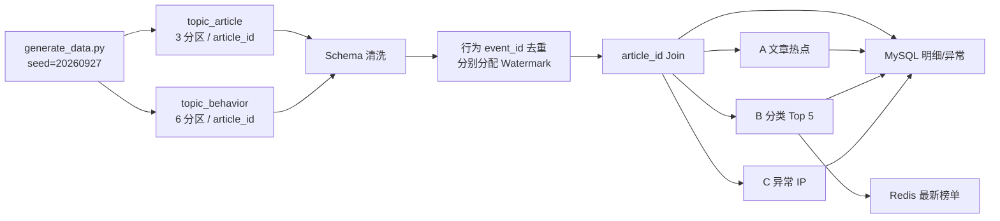

# 01 项目架构与数据字典

## 概念与设计

实时热点新闻系统把发布/更新事件当文章维度，把点击、分享、评论当事实流；`article_id` 是跨流关联键，`event_id` 是行为去重键。Kafka 缓冲并保存可回放输入，Flink 先校验和去重，再按事件时间富化行为并运行三条规则，最后由 MySQL 保存可查询历史、Redis 保存最新榜单。根目录 [README](../../readme.md) 有完整字段表和 JSON 示例；正式字段约束以 [文章 Schema](../../generator/schemas/article_stream.schema.json) 和 [行为 Schema](../../generator/schemas/behavior_stream.schema.json) 为准。

两个 Topic 的 Kafka Key 都由生成器设为 `article_id`；脚本创建 `topic_article` 3 分区、`topic_behavior` 6 分区、单副本。Java 作业默认并行度 3；分区数限制 Source 的有效读取并行度，但 `keyBy` 后热点键仍会集中于一个下游 Subtask，扩分区不等于消除热点。开发用单 Broker/单副本不是生产容灾架构。宿主机 Kafka 地址 `localhost:9092`、容器内 `kafka:29092`，Join 的公共 Source 从 `KAFKA_BOOTSTRAP_SERVERS` 环境变量取值。

## 数据字典与时间语义

| 流 | 必填业务字段 | 时间与版本 |
| --- | --- | --- |
| `article_stream` | `event_id`, `event_type`, `article_id`, `title`, `category`, `tags`, `published_at`, `event_time`, `ingest_time`, `version` | `publish/update`；最初 `version=1` 发布时刻决定有效下界，更新版本供维度展示 |
| `behavior_stream` | `event_id`, `user_id`, `article_id`, `action`, `ip`, `event_time`, `ingest_time`, `read_duration_ms` | 三种 action；阅读时长 0..86400000 ms；IPv4 按四段校验 |

`event_time` 是窗口和 Watermark 的业务时钟；`ingest_time` 仅模拟到达先后；`published_at` 是文章发布时间；`detect_time` 是输出时系统检测时间。所有时间示例均为 ISO-8601 UTC，展示时不要把北京时间与原始 UTC 混算。文章富化后的行为增加 `title/category/tags/article_version/article_published_at`。规则 A 输出点击次数和 5 分钟窗口；B 输出 10 分钟排名、分类分数及 `top_articles[]`；C 输出 IP、点击数、平均时长、窗口及撤销标志。**当前 C 主规则未输出考核示例中的 `article_ids[]`**；独立 Day 4 IP 窗口实验有该字段，但语义不同，不能代替。

## 生成器、实现与测试

[`generate_data.py`](../../generator/generate_data.py)支持数量、速率、固定 seed、乱序、脏数据比例、重复比例及 `json/kafka/both` 输出。按 `ingest_time` 发出数据，构造 5-30 秒乱序、行为先到、两篇热点文章和缺失键/负时长/未来时间。固定 [报告](../../generator/generator/data/generation_report.json)为 500 篇文章、100000 条行为、脏记录 1000、原始重复 2000、热点点击比例 0.851733；输入到达跨度约两小时。这是输入统计，不是 Kafka 或 Flink 吞吐证据。

最小 [`HotNewsKafkaSourceJob`](../../flink-job/flink-source/src/main/java/com/agd/flink/source/HotNewsKafkaSourceJob.java)只验证 Kafka 连接，使用 `noWatermarks()` 和丢弃 Sink；真正的清洗与 Join 在 [`ArticleJoinBehavior`](../../flink-job/flink-join/src/main/java/ArticleJoinBehavior.java)，一体化外部写入在 [`Day5SinkJob`](../../flink-job/flink-rolesachieve/src/main/java/Day5SinkJob.java)。五张目标表是 `clean_behavior`、`article_alert`、`category_rank`、`ip_alert`、`pipeline_event`，建表与唯一键见 [SQL](../../sql/01-day5-tables.sql)。Schema 失败和 ETL 重复目前主要在日志旁路，不能说所有脏数据已落库。

**问题与结论：**固定 seed 和原始统计可复核，设计上的 Key/分区/并行度与结果表已对应；跨机器复制部署须核实 Compose 挂载路径、口令和服务可达性。项目尚无独立 API/看板，结果可通过数据库 SQL 和 Redis 查询，不应把 Web UI 当业务查询接口。
