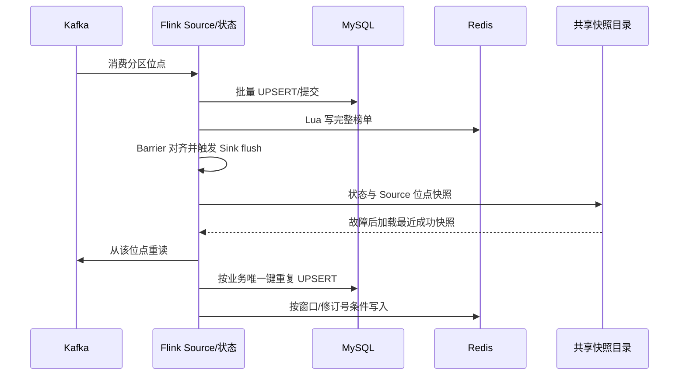

# 04 Checkpoint 与一致性

## 原理与参数

JobManager 定期触发 Checkpoint，Source 将 Barrier 放入流中；算子对齐输入后保存状态，Kafka Source 位点和状态归属同一次成功快照。恢复时从最近一次**成功**快照加载状态并从对应位点重读未确认消息；“作业 RUNNING”不足以证明各子任务已恢复并出现新的成功快照。Savepoint 是人为触发的受控迁移/升级恢复点，不能当成自动容错的同义词。

[`Day5SinkJob`](../../flink-job/flink-rolesachieve/src/main/java/Day5SinkJob.java)使用 EXACTLY_ONCE 模式，Checkpoint 间隔 10s、超时 60s、最小暂停 2s、并发数 1、容忍 3 次可计入的连续失败；固定延迟重启最多 3 次、间隔 5s，取消时保留外部 Checkpoint。10s 用于限制快照间输入重放范围，60s 给 MySQL flush、Barrier 对齐和 I/O 留出余量；具体参数适用性以成功率、时长和反压数据为准。容器共享 `/opt/flink/checkpoints` 与 `/opt/flink/savepoints`；生产跨宿主机需换共享持久存储。配置来源及 10 月 6 日采样见 [Checkpoint/Savepoint 记录](../06-Day5-Checkpoint与Savepoint记录.md)。

## 外部系统的真实边界

[`Day5MySqlSink`](../../flink-job/flink-rolesachieve/src/main/java/Day5MySqlSink.java)每 200 条或快照前 flush；明细以 `event_id`、A 以 `(window_start_ms,article_id)`、B 以 `(window_start_ms,rank_no)`、C 以 `(alert_minute_ms,ip)`、异常以 `(event_type,event_id)` 幂等 UPSERT。A 保留较大点击数，B 用 `revision` 拒绝旧排名；C 的更正/撤销没有单调版本保护，旧 Checkpoint 反向回放可能让活跃告警倒退。Redis 用 Lua 原子更新 `hotnews:top5:latest`，比较窗口与修订号、TTL 7200s；过期后丢失版本记忆。MySQL/Redis 都不与 Flink 状态进行同一个分布式事务，所以结论是 **Flink 内部快照一致 + 外部至少一次写入及有边界的幂等收敛**，不是四系统原子 Exactly-Once。详见 [一页一致性边界](../05-Day5-一致性边界.md)。

## 现场测试、问题与结论

10 月 6 日的 [原始证据](../../tests/day5/evidence/)记录故障前成功 `chk-16`（734 ms、约 53.8 MB）；SIGKILL TaskManager 后从 `chk-19` 恢复，11/11 顶点运行并产生新成功 `chk-31`（807 ms）。故障前后 MySQL 明细 97044、A 105、B 25、活跃 C 0，A/B 业务键未倒退，Redis 窗口、修订号和 Top 5 未回退；异常表增长 18 行。此时是**常驻流部分已关窗结果**，不与有界 A=123、B=60 直接比较。

随后创建 Savepoint，保持状态拓扑与 Kafka 消费语义，只把 JDBC 批大小由 200 改为 100。首轮恢复暴露 JDBC 驱动加载问题，修复并重打包后第二次加载成功，11/11 顶点运行并有新成功 `chk-72`（721 ms）；Redis 语义哈希不变。**Savepoint 后 MySQL 逐键查询、旧 Checkpoint 全链路回放、C 撤销倒退与 Redis 过期重放还未完整核验**，不能用启动成功替代结果一致性。

升级时先校验实际 Savepoint 路径和 `_metadata`，再取消旧 Job、提交兼容版本；状态描述符、序列化器、算子身份/UID、Topic/消费组或窗口语义变化都要先做隔离兼容性验证，不能用忽略未恢复状态来掩盖丢失。现场操作和未完成的逐键采样见 [Day 5 手册](../04-Day5-Sink与恢复验收.md)。
