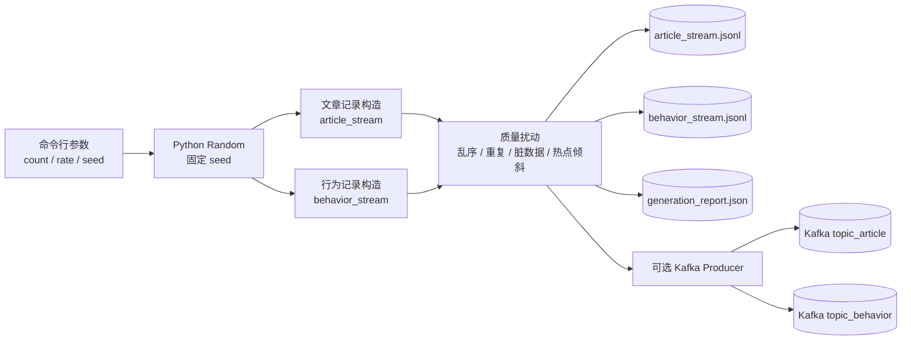

# 数据生成器

`generate_data.py` 使用 Python 标准库生成两条 JSONL 流：

- `article_stream.jsonl`：文章发布事件，供文章流 Source 使用。
- `behavior_stream.jsonl`：用户行为事件，供行为流 Source 使用。
- `generation_report.json`：数据量、行为比例、脏数据和热点点击比例统计。

两条流的严格 JSON Schema 位于：

- `schemas/article_stream.schema.json`
- `schemas/behavior_stream.schema.json`

Schema 描述的是干净数据。生成器会按 `--dirty-ratio` 故意注入不符合 Schema 的记录，用于 Flink 的脏数据过滤和 Side Output 验收。

## 最小运行

在项目根目录执行：

```powershell
py generator\generate_data.py --output json --seed 20260927
```

如果系统没有 `py` 命令，也可以使用 `python`：

```powershell
python generator\generate_data.py --output json --seed 20260927
```

默认生成 500 篇文章和 100,000 条行为，输出到 `generator/data/`。同一个 seed 重复运行会得到完全一致的数据。

## 常用参数

```powershell
py generator\generate_data.py `
  --article-count 500 `
  --behavior-count 100000 `
  --rate 2000 `
  --seed 20260927 `
  --disorder-min 5 `
  --disorder-max 30 `
  --dirty-ratio 0.01 `
  --duplicate-ratio 0.02 `
  --output json `
  --output-dir generator\data
```

`event_time` 是业务事件时间，`ingest_time` 是模拟消息到达时间。生成器按照 `ingest_time` 排序输出，因此 Flink 可以基于 `event_time` 验证 Watermark、迟到数据和双流 Join 未匹配场景。

## Kafka 输出

Kafka 输出需要额外安装客户端：

```powershell
python -m pip install kafka-python
```

请用 IDEA 运行配置中指定的 Python 解释器执行安装命令；安装到别的环境不会解决依赖缺失。
生成器默认使用 Kafka 输出，直接运行前需要安装客户端并启动 Kafka。只想生成核对用的文件时，使用 `--output json`。
先启动项目的 Kafka，再发送到默认的 `localhost:9092`：

```powershell
py generator\generate_data.py `
  --output kafka `
  --kafka-bootstrap-servers localhost:9092 `
  --article-topic topic_article `
  --behavior-topic topic_behavior `
  --rate 2000 `
  --seed 20260927
```

也可以使用 `--output both` 同时保留 JSONL 文件并发送 Kafka。

## 字段约定

两条流都包含 `event_time` 和 `ingest_time`。Flink 作业应该使用 `event_time` 创建 `WatermarkStrategy`，而不是使用处理时间。行为流通过 `article_id` 与文章流 Join。

### `article_stream` 字段

| 字段 | 类型 | 必填 | 说明 |
| --- | --- | --- | --- |
| `event_id` | string | 是 | 文章事件 ID，例如 `article-event-00000001`，用于去重 |
| `event_type` | string | 是 | `publish` 或 `update` |
| `article_id` | string | 是 | 文章主键，也是双流 Join Key |
| `title` | string | 是 | 文章标题，非空，最长 200 个字符 |
| `category` | string | 是 | 文章分类，热门话题按该字段聚合 |
| `tags` | array<string> | 是 | 文章标签，1-10 个且不重复 |
| `published_at` | string | 是 | 文章业务发布时间，ISO-8601 |
| `event_time` | string | 是 | Flink 的业务事件时间 |
| `ingest_time` | string | 是 | 模拟消息到达时间，用于制造乱序 |
| `version` | integer | 是 | 文章版本号，大于等于 1 |

### `behavior_stream` 字段

| 字段 | 类型 | 必填 | 说明 |
| --- | --- | --- | --- |
| `event_id` | string | 是 | 行为事件 ID，例如 `behavior-event-00000001`，用于去重 |
| `user_id` | string | 是 | 用户 ID |
| `article_id` | string | 是 | 被操作的文章主键，也是双流 Join Key |
| `action` | string | 是 | `click`、`share` 或 `comment` |
| `ip` | string | 是 | IPv4 地址，用于疑似刷量检测 |
| `event_time` | string | 是 | 用户行为发生时间，用于窗口和 Watermark |
| `ingest_time` | string | 是 | 模拟消息进入 Kafka 的时间 |
| `read_duration_ms` | integer | 是 | 阅读时长，单位毫秒，合法范围为 0 到 86400000 |

完整约束以 [`schemas/article_stream.schema.json`](schemas/article_stream.schema.json) 和 [`schemas/behavior_stream.schema.json`](schemas/behavior_stream.schema.json) 为准。

### 时间和异常处理

```text
event_time    = 业务事件发生时间，Flink 使用它生成 Watermark
ingest_time   = 消息进入系统的时间，生成器按照它排序后输出
published_at  = 文章业务发布时间，通常与 article_stream.event_time 一致
```

生成器默认产生 5-30 秒乱序、约 1% 脏数据和约 2% 重复事件。Flink 作业应按以下边界处理：

- 非法 JSON、缺失 `article_id`、非法阅读时长和未来时间进入 `dirty_data` Side Output。
- 重复 `event_id` 在 24 小时去重状态 TTL 内只保留一条。
- 超出 Watermark 的消息进入 `late_data`，在 `allowedLateness` 范围内允许补算。
- 文章和行为按 `article_id` Join；Join 状态过期仍未匹配的行为进入 `unmatched_behavior`。

### 生成器架构图



### 生成器输出与 Flink 的对应关系

| 生成器输出 | Flink 输入/处理 | 验收目的 |
| --- | --- | --- |
| `article_stream.jsonl` | 文章 Source，按 `event_time` 分配 Watermark | 文章维度、Join 和文章流乱序 |
| `behavior_stream.jsonl` | 行为 Source，按 `event_time` 分配 Watermark | 点击统计、Top N、刷量检测 |
| `generation_report.json` | 独立基准统计 | 核对输入数量、行为比例和热点点击占比 |
| Kafka `topic_article` | Kafka Source | 验证文章流实时消费和位点恢复 |
| Kafka `topic_behavior` | Kafka Source | 验证行为流实时消费、反压和 Checkpoint |

生成器会覆盖以下边界：

- `click`、`share`、`comment` 三种行为。
- 5-30 秒随机乱序。
- 约 1% 的空 `article_id`、负阅读时长或未来时间。
- 约 2% 的重复 `event_id`。
- 前两个文章 ID 承载大部分点击，用于热点 Key 倾斜测试。
- 部分行为消息的 `ingest_time` 早于对应文章消息，模拟双流 Join 未匹配和后续补偿。

当前目录不是 Maven 模块，不需要 `pom.xml`。
