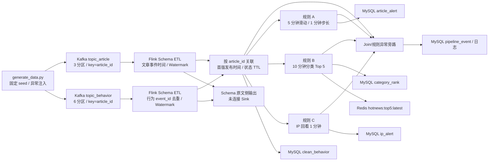

# 实时热点新闻检测系统

本项目按[《Flink 大数据 7 天学习目标与考核标准》](鲍献锐-Flink%20大数据%207%20天学习目标与考核标准.pdf)实现：从文章发布流和用户行为流识别热点文章、热门话题及疑似刷量 IP。本文将**已有代码、本地核验结果和待完成的线上验收**分开记录；有源码或离线基准不等于已经通过 Kafka、MySQL、Redis 和故障恢复验收。

## 架构与数据流



Kafka 缓冲突发流量并保留可回放的原始消息；两条 Topic 都按 `article_id` 作为消息 Key，便于关联和局部有序。文章 3 分区、行为 6 分区，作业默认并行度 3；行为流的分区数为后续扩容留出空间，但整体吞吐仍取决于最慢的算子、Sink 和资源配置。`event_time` 负责窗口与迟到判断，不能用处理时间代替。最小 Source 示例与实际 ETL/Join 作业是两个不同的入口。

| 目录 | 项目用途 |
| --- | --- |
| [`generator/`](generator/README.md) | 可复现的双流 JSONL/Kafka 数据、Schema 和生成报告 |
| [`flink-job/`](flink-job/pom.xml) | Source、双流 Join、规则 A/B/C、状态实验和外部 Sink |
| [`sql/`](sql/README.md) | MySQL 五张表、查询 SQL；独立规则基准 SQL 在 `tests/roles/` |
| [`deploy/`](deploy/README.md) | 本项目的 Compose、Flink 配置和 Topic 脚本 |
| [`tests/`](tests/README.md) | 固定数据、边界用例、独立 SQL 对照及本地性能实验 |
| [`docs/`](docs/README.md) | 按考核顺序索引的[项目笔记](docs/项目笔记/01-项目架构与数据字典.md)、现场记录和测试报告 |

## 输入字段与约束

完整约束见 [`article_stream.schema.json`](generator/schemas/article_stream.schema.json) 和 [`behavior_stream.schema.json`](generator/schemas/behavior_stream.schema.json)。下表是**合法主流**的必填字段；生成器按配置额外注入脏记录，不能把这些异常当成合法输入。

### `article_stream`：文章发布或更新

| 字段 | JSON 类型 | 必填 | 含义/校验 |
| --- | --- | --- | --- |
| `event_id` | string | 是 | 文章事件 ID |
| `event_type` | string | 是 | `publish` 或 `update` |
| `article_id` | string | 是 | 文章业务键和双流 Join Key |
| `title` | string | 是 | 非空，最长 200 字符 |
| `category` | string | 是 | 话题分类，用于规则 B |
| `tags` | array<string> | 是 | 1-10 个不重复标签 |
| `published_at` | string | 是 | ISO-8601 业务发布时间 |
| `event_time` | string | 是 | ISO-8601 事件时间，用于 Watermark |
| `ingest_time` | string | 是 | 模拟进入系统的时间，用于到达顺序 |
| `version` | integer | 是 | 版本号，至少为 1 |

```json
{"event_id":"article-event-00000001","event_type":"publish","article_id":"article-000001","title":"实时热点新闻示例","category":"technology","tags":["热点","实时"],"published_at":"2026-09-27T00:12:34.567Z","event_time":"2026-09-27T00:12:34.567Z","ingest_time":"2026-09-27T00:12:52.141Z","version":1}
```

### `behavior_stream`：点击、分享、评论

| 字段 | JSON 类型 | 必填 | 含义/校验 |
| --- | --- | --- | --- |
| `event_id` | string | 是 | 行为事件 ID，去重 Key |
| `user_id` | string | 是 | 用户 ID |
| `article_id` | string | 是 | 目标文章 ID；Join Key |
| `action` | string | 是 | `click`、`share`、`comment` |
| `ip` | string | 是 | IPv4 地址；规则 C 的 Key |
| `event_time` | string | 是 | ISO-8601 行为发生时间 |
| `ingest_time` | string | 是 | 模拟到达时间；生成器按此排序 |
| `read_duration_ms` | integer | 是 | 阅读时长，0-86400000 ms |

```json
{"event_id":"behavior-event-00000001","user_id":"user-000017","article_id":"article-000001","action":"click","ip":"10.1.2.3","event_time":"2026-09-27T00:13:05.042Z","ingest_time":"2026-09-27T00:13:21.781Z","read_duration_ms":1850}
```

`published_at` 是文章发布时间；`event_time` 是计算依据；`ingest_time` 是到达顺序模拟值。文章最初的 `version=1` 发布事件决定行为的有效时间下界，更新版不能取代这个下界。

## 数据生成与固定输入

在根目录使用 Python 运行（有 `py` 启动器时也可将 `python` 改为 `py`）：

```powershell
python generator\generate_data.py `
  --article-count 500 --behavior-count 100000 --rate 2000 `
  --seed 20260927 --disorder-min 5 --disorder-max 30 `
  --dirty-ratio 0.01 --duplicate-ratio 0.02 `
  --output json --output-dir generator\example-data
```

`--output json` 仅写 JSONL 和统计报告；`--output kafka` 写 Kafka，`--output both` 两者都写（Kafka 输出需安装 `kafka-python`）。固定验收文件已保存在 `generator/generator/data/`，**不要为查看结果重跑到该目录或对同一 Topic 重复发送**。同一 seed、参数和输出目录可以对照两次生成结果；`--rate` 控制发送/写出节奏，不是已经达到的持续处理吞吐。

[`generation_report.json`](generator/generator/data/generation_report.json)记录固定 seed 的 500 篇文章、100000 条行为、1000 条脏记录、2000 个重复事件；两篇热点文章占点击约 85.17%，两流到达覆盖至少 1 小时。异常包括空 `article_id`、负时长、未来时间，以及行为先于文章到达。报告的重复数是原始数据中的重复数；Schema 清洗后的重复口径以独立 SQL 基准为准。

## 程序与类：作用和思路

Python 生成器负责造数；Java 类按“有 `main` 的独立作业 / 被作业调用的组件 / 测试”区分。`--bounded` 只用于隔离固定批次回放，持续消费不传此参数；不能把辅助类单独作为 Flink 作业提交。

| 独立入口（按处理阶段） | 作用 | 实现思路及边界 |
| --- | --- | --- |
| [`generate_data.py`](generator/generate_data.py) | 生成双流及统计报告，可发送 Kafka | 固定 seed，按 `ingest_time` 排序，注入乱序、脏记录、重复、热点倾斜及跨流先后颠倒；`--rate` 是生成速率，不是 Flink 实测吞吐 |
| [`HotNewsKafkaSourceJob`](flink-job/flink-source/src/main/java/com/agd/flink/source/HotNewsKafkaSourceJob.java) | 最小 Kafka 连通性演示 | 原始文本双 Source + `noWatermarks()` + 丢弃 Sink；地址硬编码 `localhost:9092`，适合宿主机演示，**不是**实际 Join/规则入口，也不做 Schema/业务计算 |
| [`ArticleJoinBehavior`](flink-job/flink-join/src/main/java/ArticleJoinBehavior.java) | 可独立运行的 ETL/Join，也是其他作业的共享入口 | 双流分别校验、行为 `event_id` 去重后生成 Watermark；按 `article_id` 暂存先到行为，等首次发布后富化；有界模式从两条 Topic 起点回放并打印 Join ID/总数 |
| [`Achieve_roleA`](flink-job/flink-rolesachieve/src/main/java/Achieve_roleA.java) | 文章热点告警 | 仅计 `click`，按文章做 5 分钟滑窗、1 分钟步长，点击 **>1000** 输出告警；窗口关闭后允许保留期内修订 |
| [`Achieve_roleB`](flink-job/flink-rolesachieve/src/main/java/Achieve_roleB.java) | 10 分钟分类 Top 5 | 对点击/分享/评论按文章和窗口计数，再按分类汇总排序；输出分类名次、每类 `top_articles[]` 和完整榜单快照，迟到用 `revision` 修订 |
| [`Achieve_roleC`](flink-job/flink-rolesachieve/src/main/java/Achieve_roleC.java) | 疑似刷量 IP 告警 | 每次点击按 IP 回看前 1 分钟；不同文章数 **>50** 且平均阅读时长 **<2000 ms** 时告警，晚到可更新/撤销；主输出尚无 `article_ids[]` |
| [`ArticleHeatStateJob`](flink-job/flink-rolesachieve/src/main/java/ArticleHeatStateJob.java) | Day 4 文章状态与热 Key 实验 | 基线复用 A，优化模式按 `event_id` 将热点分成 16 片再合并，额外保存最近热度快照（处理时间 TTL 24 小时） |
| [`IpWindowStateJob`](flink-job/flink-rolesachieve/src/main/java/IpWindowStateJob.java) | Day 4 IP 状态与倾斜实验 | 基线按 IP 聚合，优化模式 16 片两阶段合并文章 ID 集合/点击/时长，状态 TTL 1 小时；**1 分钟不重叠窗口不等于规则 C 的逐点击回看** |
| [`Day5SinkJob`](flink-job/flink-rolesachieve/src/main/java/Day5SinkJob.java) | 共享清洗流驱动 A/B/C 与外部存储 | 配置 10 秒 Checkpoint 和失败重启，将明细/告警/异常写 MySQL、完整榜单写 Redis；`--plan` 只构建执行图，不连接外部系统 |
| [`Day6BackpressureJob`](flink-job/flink-rolesachieve/src/main/java/Day6BackpressureJob.java) | Day 6 **隔离压测** | 从 A 复制滑窗计算分支，另接可控慢 Sink；支持限速合成源或独立 `hotnews-day6-*` Kafka Topic，按速率、键数、延迟/并行度比较反压、Checkpoint 与 Lag；不连接真实 MySQL/Redis |

Day 4 两个入口支持 `--optimized`、`--bounded`、`--backend=hashmap|rocksdb`、`--run-id=...`（隔离消费组）。`Day5SinkJob` 支持 `--bounded`、`--plan`、`--mysql-batch-size 1..10000`（前两者不可同时传）；默认批量 200，也可用 `HOTNEWS_MYSQL_BATCH_SIZE` 设置。Day 6 支持 `--rate`、`--seconds`、`--parallelism`、`--sink-parallelism`、`--delay-ms`、`--keys`、`--target mysql|redis`、`--plan`；Kafka 模式须同时传隔离的 `--kafka-topic` 和 `--kafka-group`。安全范围与复现步骤见 [`tests/day6/README.md`](tests/day6/README.md)。

| 非独立入口类 | 作用 | 实现思路及边界 |
| --- | --- | --- |
| [`Constant`](flink-job/common/src/main/java/constant/Constant.java) | 共享业务 Topic 常量 | 定义 `topic_article` 和 `topic_behavior`；其中旧的 `KAFKA_BROKERS` 常量不是实际 Join 连接地址 |
| [`FlinkSourceUtil`](flink-job/common/src/main/java/util/FlinkSourceUtil.java) | 为 Join/规则构造 Kafka Source | 从 `KAFKA_BOOTSTRAP_SERVERS` 取地址（默认 `localhost:9092`）；持续行为消费组优先用已提交位点，新组回退最早位点；有界全量回放显式从最早位点读到启动时末尾 |
| [`RoleStreamUtil`](flink-job/flink-rolesachieve/src/main/java/RoleStreamUtil.java) | 规则入口二次去重与时间恢复 | 按 `event_id` 做 24 小时处理时间 TTL 防重，再按行为 `event_time` 重新分配 Watermark，避免 Join 补发时的时间戳污染规则窗口 |
| [`Day5MySqlSink`](flink-job/flink-rolesachieve/src/main/java/Day5MySqlSink.java) | 写五类 MySQL 表 | JDBC 批量 UPSERT，达批次阈值或快照前提交；恢复时显式加载 JDBC 驱动；A 点击数取较大值、B 用修订号防旧榜单，C 旧快照撤销仍有版本风险 |
| [`Day5RedisRankSink`](flink-job/flink-rolesachieve/src/main/java/Day5RedisRankSink.java) | 写 Redis 最新榜单 | 单并行度接收规则 B 的 rank=1 完整快照，Lua 按窗口和修订号原子覆盖，Key 保留 2 小时；过期后不再有版本记忆 |
| [`Day6SyntheticSource`](flink-job/flink-rolesachieve/src/main/java/Day6SyntheticSource.java) | 隔离合成负载输入 | 单调时钟按并行子任务分摊目标速率，打上实际发出时间；不能用于证明 Kafka Lag |
| [`Day6KafkaRecordDeserializer`](flink-job/flink-rolesachieve/src/main/java/Day6KafkaRecordDeserializer.java) | 独立压测 Topic 的记录转换 | 从分区/offset 构造 ID，用 Kafka 记录时间戳计算排队延迟；不解析业务双流 Schema |
| [`Day6DelaySink`](flink-job/flink-rolesachieve/src/main/java/Day6DelaySink.java) | 可控慢 Sink 与指标探针 | 每条同步等待指定毫秒，记录消费数和**最近一条**时延；`mysql`/`redis` 只是模拟目标标签，时延 Gauge 不是 p95 |

| 测试类（均不提交为作业） | 验证思路 |
| --- | --- |
| [`RoleRulesTest`](flink-job/flink-rolesachieve/src/test/java/RoleRulesTest.java) | 用固定输入断言 Join/去重/迟到补发、A/B/C 阈值与修订，以及 Day 4 两种聚合模式的结果一致性 |
| [`Day4SkewBenchmark`](flink-job/flink-rolesachieve/src/test/java/Day4SkewBenchmark.java) | 显式启用的本地热点基准；同批输入交错测基线/加盐分布、吞吐和 Source-to-keyed p95，输出 JSON |
| [`Day5SinkContractTest`](flink-job/flink-rolesachieve/src/test/java/Day5SinkContractTest.java) | 检查 UPSERT、撤销字段、批量参数、异常键和 JDBC 类路径契约，不代替现场写库 |
| [`Day5LiveSinkIntegrationTest`](flink-job/flink-rolesachieve/src/test/java/Day5LiveSinkIntegrationTest.java) | 按环境开关用临时 MySQL 表/独立 Redis Key 验证旧版本拒绝；未启用或认证失败不得视为通过 |
| [`Day6BackpressureJobTest`](flink-job/flink-rolesachieve/src/test/java/Day6BackpressureJobTest.java) | 验证压测参数上限与 Kafka Topic/消费组隔离约束，不测真实 Sink 容量 |

独立非 Java 验证入口：[`tests/day2/verify.py`](tests/day2/verify.py) 以 SQLite 核对固定输入；[`tests/roles/verify.js`](tests/roles/verify.js) 从原始 JSONL 运行 [`prepare.sql`](tests/roles/prepare.sql) 与 A/B/C 独立 SQL，并可逐窗口比对 Flink 日志。按考核项阅读笔记见 [`docs/README.md`](docs/README.md)。

## 时间、状态与异常处理

- 清洗后才取 `event_time`：文章乱序等待 30 秒，行为持续作业等待 65 分钟，隔离有界回放等待 2 小时；空闲分区 30 秒后不再拖住活跃分区的 Watermark。这些行为等待值用于处理实际跨分区到达跨度，不是生成器 5-30 秒乱序参数的同义词。
- Schema 解析失败或字段非法进入 `dirty_data` 侧输出；跨流时序非法进入 `dirty_data_temporal` 侧输出。当前 `ArticleJoinBehavior.createJoinedStream` 中原始 Schema 脏数据、重复事件等旁路的 `print` 已被注释，**没有连接可查询 Sink，不能当成已保存的日志**。行为清洗后按 `event_id` 去重，处理时间 TTL 24 小时；超期后的同一 ID 不能承诺全局永久去重。
- Join 文章状态与首版发布时间状态处理时间 TTL 2 小时。行为先到时输出 `UNMATCHED_BEHAVIOR` 并暂存；文章到达后自动补 Join。等待期满或有界回放结束仍未解决，输出 `REPLAY_REQUIRED`，需保留原始 Kafka 消息作隔离回放；实际不存在的文章无法补齐。
- 超过 Join 30 秒允许迟到边界的记录输出 `LATE_DATA`，仍尝试时序 ETL/Join。A/B/C 可修正的事件时间状态在窗口结束后保留 24 小时，超过各自边界进入 `ROLE_*_LATE` 旁路，不等于已经在线补算。独立 Day 4 文章快照处理时间 TTL 为 24 小时，IP 实验状态 TTL 为 1 小时；TTL 不是 Watermark，也不保证立即物理回收。
- `Day5SinkJob` 的 `pipeline_event` 接入 Join 未匹配、迟到、时序脏数据、待回放及 A/B/C 超期事件；Schema 原文脏数据、ETL 重复等旁路未接入该表，**不能声称所有异常都已持久化**。后续审计须单独为这些未消费侧输出接 Sink。

## 本项目运行命令

环境依赖：Python、Node.js（支持 `node:sqlite`）、Java 8/Maven；本项目 Compose 的 Flink 镜像使用 Java 11。Kafka 数据生成还需 `kafka-python`。以下 PowerShell 命令均在项目根目录执行，假设本项目的 Kafka/Flink/MySQL/Redis 服务及 `deploy/.env` 已就绪；环境准备、端口和配置参见 [`deploy/README.md`](deploy/README.md)，此处仅保留本项目数据、作业和核验命令，不提供 Docker 通用启动教程。勿将实际口令提交仓库。

```powershell
# 创建本项目的文章/行为 Topic。
powershell -ExecutionPolicy Bypass -File deploy\create-kafka-topics.ps1

# 在隔离 Topic/空消费环境发送固定参数数据；不要向已有验收 Topic 重复发送。
python generator\generate_data.py --article-count 500 --behavior-count 100000 `
  --rate 2000 --seed 20260927 --disorder-min 5 --disorder-max 30 `
  --dirty-ratio 0.01 --duplicate-ratio 0.02 --output kafka `
  --kafka-bootstrap-servers localhost:9092

# 构建一体化作业；Compose 把 target 目录挂到 Flink 容器内。
mvn -f flink-job\pom.xml -pl flink-rolesachieve -am package
docker compose --env-file deploy\.env -f deploy\docker-compose.yml exec jobmanager `
  flink run -d -c Day5SinkJob /opt/flink/usrlib/flink-rolesachieve-1.0-SNAPSHOT-all.jar

# 核验本项目作业、MySQL 结果和 Redis 榜单；Checkpoint 指标见 Web UI。
docker compose --env-file deploy\.env -f deploy\docker-compose.yml exec jobmanager flink list
docker compose --env-file deploy\.env -f deploy\docker-compose.yml exec mysql `
  mysql -uroot -p hotnews
# 输入实际口令后，在 mysql> 中执行 SOURCE /docker-entrypoint-initdb.d/queries/day5-check.sql;
docker compose --env-file deploy\.env -f deploy\docker-compose.yml exec redis `
  redis-cli HGETALL hotnews:top5:latest
docker compose --env-file deploy\.env -f deploy\docker-compose.yml exec redis `
  redis-cli TTL hotnews:top5:latest
```

Flink Web UI：Docker `http://localhost:8081`；本地 Source 演示 `http://localhost:8082`。宿主机程序连接 Kafka 用 `localhost:9092`，容器内作业通过 Compose 环境变量连接 `kafka:29092`。Compose 中 Checkpoint/Savepoint 绑定目录是 `D:\docker_data\flink\checkpoints` / `D:\docker_data\flink\savepoints`，换机需先修改绑定路径。MySQL 的初始化脚本只在**新数据目录**第一次启动时执行；已有数据卷需要手动应用 [`01-day5-tables.sql`](sql/01-day5-tables.sql)，不要通过删卷来加载新表。

Day 5 曾在 2026-10-06 现场运行，历史结果见
[`记录`](docs/06-Day5-Checkpoint与Savepoint记录.md)；这不代表当前
`Day5SinkJob` 正在运行。更详细的提交、查询及故障演练步骤见
[`Day 5 操作手册`](docs/04-Day5-Sink与恢复验收.md)。
改动 Compose 后的配置核对和维护操作见 [`deploy/README.md`](deploy/README.md)，
不要为了核验文档而重新创建运行中的容器。

## 对照测试与考核证据

```powershell
# 独立离线基准：从原始 JSONL 生成逐窗口结果，不读取 Flink 输出。
node --no-warnings tests\roles\verify.js
node --no-warnings --test tests\roles\baseline.test.js
python tests\day2\verify.py

# Java 边界及 Sink 合约测试；第四天倾斜基准需单独显式运行。
mvn -o -f flink-job\pom.xml -pl flink-rolesachieve -am test
mvn -o -f flink-job\pom.xml -pl flink-rolesachieve -am `
  '-Dtest=Day4SkewBenchmark' '-Dsurefire.failIfNoSpecifiedTests=false' `
  '-Dday4.backend=hashmap' test

# 取得一次隔离批次的 Flink UTF-8 日志后，逐窗口核对（示例：规则 B）。
node --no-warnings tests\roles\verify.js --role b --flink-log tests\roles\role-b-snapshot-20261005.log
```

Day 4 的 Docker HashMap/RocksDB 完整批次对照用 [`tests/day4/run-docker-day4.ps1`](tests/day4/run-docker-day4.ps1)；Day 6 的限速合成输入、独立 Kafka Topic、采样与追平用 [`tests/day6/README.md`](tests/day6/README.md) 的项目专用脚本。共享集群存在其他作业时不要直接提交压测；只对隔离 Topic/消费组运行，勿以 `--target mysql|redis` 推断已测试真实外部存储。

固定输入的独立 SQL 口径：500 篇有效文章、99000 条 Schema 合法行为，其中 1956 条重复 `event_id`；去重后可 Join 的行为为 **97044**。A 最终 **123** 行、B 最终 **60** 行、C **0** 行。保留的有界回放日志 [`Join`](tests/roles/join-etl-dedup-20261005.log)、[`A`](tests/roles/role-a-etl-dedup-20261005.log)、[`B 完整快照`](tests/roles/role-b-snapshot-20261005.log)、[`C`](tests/roles/role-c-etl-dedup-20261005.log)用于对照；C=0 只能说明该大样本无告警，其 49/50/51 篇、1999/2000 ms 和迟到撤销正例由 [`RoleRulesTest`](flink-job/flink-rolesachieve/src/test/java/RoleRulesTest.java)验证。未关闭的持续流窗口不能和完整有界基准直接比较。

| PDF 考核项 | 本仓库证据及当前状态 |
| --- | --- |
| Day 1：字段、架构、生成器 | 本文 Schema/示例/架构；固定 [`generation_report.json`](generator/generator/data/generation_report.json) 与生成器；重复运行应在**新目录**核对文件一致性 |
| Day 2：Watermark、脏数据、Join、补算 | `ArticleJoinBehavior`、[`tests/day2/`](tests/day2/README.md) 离线基准及边界输入；在线空闲分区/迟到完整回放日志仍需补足 |
| Day 3：A/B 窗口、阈值、独立基准 | [`tests/roles/`](tests/roles/README.md) 中逐窗口 SQL、回放日志及 Java 边界测试 |
| Day 4：C、去重、TTL、热点倾斜 | [`状态与倾斜报告`](docs/05-第四天状态与倾斜验收报告.md)、[`Day 4 实验`](tests/day4/README.md)：本地固定热点结果一致；Docker Linux 已保存 HashMap/RocksDB 8 组有效批次和资源对照，RocksDB 加盐两组各有 1 次 Checkpoint 失败；Docker 作业 p95 未采集 |
| Day 5：MySQL/Redis、Checkpoint、恢复 | 已有真实 MySQL/Redis 写入、TaskManager Kill 自动恢复、Savepoint 后状态加载及 Redis 证据；Savepoint 后 MySQL 逐键核验、旧 Checkpoint 回放和有界最终值待补，见 [`记录`](docs/06-Day5-Checkpoint与Savepoint记录.md) |
| Day 6：2000/5000 events/s、反压、容量 | [`现场报告`](docs/05-反压压测与容量规划.md)、[`原始数据`](tests/day6/results/)：隔离合成源 2000/5000 档、模拟慢 Sink/并行度调优、Kafka Lag 与追平、Checkpoint/堆/网络指标已记录；**真实 MySQL/Redis 降速、业务 Topic Lag、OOM 和端到端 p95 未验证** |
| Day 7：空环境、故障、回归 | 文档和恢复 SOP 位于 [`docs/`](docs/README.md)；空环境完整运行、至少两类现场故障、截图及恢复后逐表核对尚待执行 |

第四天本地数据为每组 12000 条、90% 热点、并行度 3，两轮对照显示加盐改善 Subtask 分布且结果一致，但吞吐没有稳定提升；Docker HashMap/RocksDB 的八组结果是**完整批次**耗时与资源对照，不能当成持续处理上限或端到端 p95。第六天合成源的 35 秒档观测约 1999/s、4984/s；模拟 2 ms/条、Sink 并行度 2 时 Source 出现反压，调到 4 后同批完成时间由 54.667 秒降为 28.343 秒。隔离 Kafka 慢 Sink 消费组 Lag 曾上升至 25583，恢复提高并行度后达到连续两次 Lag=0 且 Checkpoint 成功；单条“最近延迟”不是 p95。指标定义和 Job ID 见 [`Day 6 报告`](docs/05-反压压测与容量规划.md)。

**与 PDF 的已知差距：**规则 C 主作业输出有 `article_count`、`click_count`、平均时长和窗口时间，但**没有**考核示例要求的 `article_ids[]`；该字段仅出现在语义不同的 `IpWindowStateJob`，不可冒充规则 C 的输出。当前也没有可查询结果的 API/看板。补齐前不得声称这两项已交付。

## Checkpoint 与一致性边界

`Day5SinkJob` 设置 Checkpoint 间隔 10 秒、超时 60 秒、最小间隔 2 秒、最多 1 个并发、容忍 3 次连续失败，取消作业时保留外部 Checkpoint，失败后固定延迟重启最多 3 次。10 秒间隔对应小批量写入与恢复频率的折中，60 秒超时及最小间隔用于给慢 Sink/反压留出余量；实际是否合适需要现场记录 Barrier 对齐、Checkpoint 耗时和失败原因。Savepoint 用于受控停止/升级；不能随意更换状态描述符、序列化格式和算子拓扑。

```text
Kafka 消费 -> Flink 去重/Join/规则状态 -> MySQL 批量 UPSERT / Redis 原子榜单
                           -> Sink 在 Checkpoint 前 flush -> 状态及 Kafka 位点快照
故障恢复 <- 从最近一次成功快照恢复状态/位点 <- 重放未确认事件
                           -> MySQL 唯一键覆盖 / Redis 拒绝旧窗口及旧修订号
```

Checkpoint 保证 **Flink 状态和 Kafka 位点**的一致恢复；MySQL/Redis 并未加入同一个分布式事务。外部结果是**至少一次写入 + 有边界的业务幂等收敛**，不是跨 MySQL 与 Redis 的原子 Exactly-Once。MySQL 用事件 ID、窗口与文章、窗口与名次、告警分钟与 IP 等唯一键；Redis 在 Key 未过期时拒绝更旧的窗口/修订号。规则 C 的旧快照回放目前不能阻止活跃告警/撤销倒退，Redis 过期后也失去版本记忆。故障重放期间，多张表不保证同一瞬间一致，待消费追平后再以 [`day5-check.sql`](sql/queries/day5-check.sql)核验；异常旁路中的超期数据需另行离线补算。

考核 PDF 的提交截止日期为 **2026 年 10 月 6 日**。最终提交 ID：**待实际推送后填写**。最终推送、版本标签 `v1.0-final`、监控截图和故障/压测原始证据需在实际完成后记录，不以本地文件或待执行命令代替最终验收。
