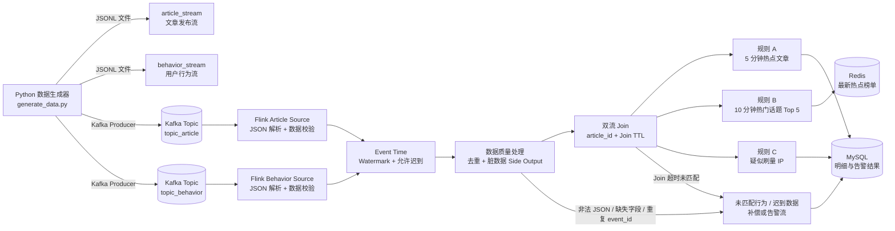

# Realtime Hot News

第四天刷量、去重、TTL 与热点 Key 倾斜的代码说明、固定输入和本地验收：
[`tests/day4/README.md`](tests/day4/README.md)；
状态设计与实测报告：
[`docs/03-状态TTL与内存模型笔记.md`](docs/03-状态TTL与内存模型笔记.md)。

实时热点新闻检测系统学习项目。

项目目标是使用 Kafka、Flink、MySQL 和 Redis，完成文章流与用户行为流的实时处理，覆盖：

- Event Time、Watermark、迟到数据和 Side Output
- 双流 Join、未匹配数据和 Join 状态 TTL
- 热点文章、热门话题和疑似刷量规则
- Keyed State、状态 TTL、去重和热点 Key 优化
- MySQL 批量幂等 UPSERT 和 Redis 榜单
- Checkpoint、Savepoint、故障恢复和端到端一致性
- 压测、反压、吞吐量、延迟和资源使用分析

## 目录结构

```text
hotnews-realtime/
├── generator/       # Python 数据生成器，输出 JSON 文件或 Kafka 消息
├── flink-job/       # Flink Maven 聚合模块
│   └── flink-source/ # Kafka Source 和输入流作业
├── sql/             # 表结构、基准 SQL、UPSERT 和结果核对 SQL
├── deploy/          # Docker Compose 及本地依赖服务配置
├── tests/           # 固定输入、边界数据和预期输出
├── docs/            # 架构、学习笔记、压测报告和故障 SOP
├── README.md
├── .gitignore
└── pom.xml
```

`generator/`、`sql/`、`tests/`、`docs/` 和 `deploy/` 是项目资料或运行目录，不需要创建 Maven `pom.xml`。Flink 代码统一放在 `flink-job/` 下，由它管理 `flink-source/` 等子模块。

## 系统架构

系统由数据生成、消息缓冲、实时计算和结果存储四部分组成。两条输入流使用相同的 `article_id` 作为关联键，Flink 使用 `event_time` 处理乱序、迟到和窗口计算，使用 `ingest_time` 表示消息实际进入系统的先后顺序。



### 数据流与职责

| 模块 | 输入 | 主要职责 | 输出 |
| --- | --- | --- | --- |
| Python 数据生成器 | 参数、随机种子 | 生成可重复的文章流和行为流，注入乱序、重复和脏数据 | JSONL 文件或 Kafka 消息 |
| Kafka | 两个 Topic | 缓冲输入、解耦生成器和 Flink、保留消费位点 | `article_stream`、`behavior_stream` |
| Flink Source | Kafka JSON 消息 | 反序列化、字段校验、提取 `event_time`、分配 Watermark | 合法主流、脏数据 Side Output |
| 双流 Join | 文章流、行为流 | 按 `article_id` 补充 `title/category/tags`，使用 Join 状态 TTL | 富化后的行为事件、未匹配事件 |
| 规则算子 | 富化后的行为事件 | 计算热点文章、热门话题和疑似刷量 IP | 三类业务结果 |
| MySQL Sink | 明细、告警、未匹配结果 | 批量、幂等 UPSERT，便于 SQL 核对 | 可查询的结果明细 |
| Redis Sink | 最新榜单 | 保存最新 Top N，便于快速读取 | 热点榜单 Key |

### Kafka Topic 约定

| Topic | 消息来源 | Kafka Key | 主要关联字段 | 默认分区建议 |
| --- | --- | --- | --- | --- |
| `topic_article` | Python 生成器 | `article_id` | `article_id` | 3 |
| `topic_behavior` | Python 生成器 | `article_id` | `article_id`、`event_id` | 6 |

开发阶段可以使用 Compose 的单 Broker 和自动创建 Topic；进行压测时建议显式创建 Topic，并根据吞吐量调整分区数。行为流通常比文章流大，因此分区数可以更高。

## 两条输入流的字段说明

完整 JSON Schema 位于：

- [`generator/schemas/article_stream.schema.json`](generator/schemas/article_stream.schema.json)
- [`generator/schemas/behavior_stream.schema.json`](generator/schemas/behavior_stream.schema.json)

Schema 约束的是合法主流。生成器会按 `--dirty-ratio` 故意注入不符合 Schema 的事件，用来验证 Flink 的数据质量过滤和 Side Output，不能把所有输入都当作合法数据直接进入业务计算。

### `article_stream`

文章发布或更新事件。该流是行为流 Join 的文章维度来源，提供 `title`、`category` 和 `tags`。

| 字段 | JSON 类型 | 必填 | 说明 | 校验/示例 |
| --- | --- | --- | --- | --- |
| `event_id` | string | 是 | 文章事件唯一标识，用于去重 | `article-event-00000001` |
| `event_type` | string | 是 | 文章事件类型 | `publish` 或 `update` |
| `article_id` | string | 是 | 文章业务主键，也是两条流的 Join Key | `article-000001` |
| `title` | string | 是 | 文章标题 | 非空，最长 200 个字符 |
| `category` | string | 是 | 文章分类，热门话题按该字段聚合 | 例如 `technology` |
| `tags` | array<string> | 是 | 文章标签列表 | 1-10 个，不允许重复 |
| `published_at` | string | 是 | 文章原始发布时间 | ISO-8601，例如 `2026-09-27T01:15:22.123Z` |
| `event_time` | string | 是 | Flink 使用的业务事件时间 | 通常与 `published_at` 一致 |
| `ingest_time` | string | 是 | 模拟消息进入 Kafka/Source 的时间 | 用于生成乱序到达顺序，不替代 `event_time` |
| `version` | integer | 是 | 同一文章的版本号 | 大于等于 1 |

示例：

```json
{
  "event_id": "article-event-00000001",
  "event_type": "publish",
  "article_id": "article-000001",
  "title": "technology领域迎来新变化，专家解读背后的关键机会",
  "category": "technology",
  "tags": ["热点", "实时", "趋势"],
  "published_at": "2026-09-27T00:12:34.567Z",
  "event_time": "2026-09-27T00:12:34.567Z",
  "ingest_time": "2026-09-27T00:12:52.141Z",
  "version": 1
}
```

### `behavior_stream`

用户对文章产生的行为事件。该流是主要事实流，用于统计点击、分享、评论和疑似刷量行为。

| 字段 | JSON 类型 | 必填 | 说明 | 校验/示例 |
| --- | --- | --- | --- | --- |
| `event_id` | string | 是 | 行为事件唯一标识，用于事件去重 | `behavior-event-00000001` |
| `user_id` | string | 是 | 用户标识 | `user-000001` |
| `article_id` | string | 是 | 被操作的文章主键，也是 Join Key | `article-000001` |
| `action` | string | 是 | 用户行为类型 | `click`、`share` 或 `comment` |
| `ip` | string | 是 | 用户来源 IP，用于刷量检测 | IPv4，例如 `10.1.2.3` |
| `event_time` | string | 是 | 用户行为发生时间 | Flink Watermark、窗口和 TTL 逻辑使用此字段 |
| `ingest_time` | string | 是 | 模拟行为消息到达时间 | 生成器按此字段排序输出 |
| `read_duration_ms` | integer | 是 | 阅读时长，单位毫秒 | 合法值为 `0` 到 `86400000` |

示例：

```json
{
  "event_id": "behavior-event-00000001",
  "user_id": "user-000017",
  "article_id": "article-000001",
  "action": "click",
  "ip": "10.1.2.3",
  "event_time": "2026-09-27T00:13:05.042Z",
  "ingest_time": "2026-09-27T00:13:21.781Z",
  "read_duration_ms": 1850
}
```

### 时间字段的处理原则

| 字段 | 含义 | Flink 用途 |
| --- | --- | --- |
| `event_time` | 事件在业务系统中实际发生的时间 | `fromTimestamp()`、Watermark、窗口、迟到判断、Join |
| `ingest_time` | 事件被消息系统或 Source 接收的模拟时间 | 验证乱序、消息先后和双流未匹配场景 |
| `published_at` | 文章的业务发布时间 | 文章维度展示和与 `event_time` 的一致性检查 |

不要用处理时间替代 `event_time`。生成器会让消息按照 `ingest_time` 到达，同时让 `event_time` 产生 5-30 秒的乱序，这正是本项目验证 Watermark 和 `allowedLateness` 的测试基础。

### 数据质量与 Side Output

生成器默认会覆盖以下异常：

| 异常类型 | 生成方式 | Flink 处理建议 |
| --- | --- | --- |
| 缺失关联键 | `article_id = null` | 进入 `dirty_data` Side Output |
| 非法数值 | `read_duration_ms < 0` | 进入 `dirty_data` Side Output |
| 未来事件时间 | `event_time` 远大于当前测试时间 | 拒绝或进入脏数据流 |
| 重复事件 | 重复 `event_id` | 按 `event_id` 去重，状态 TTL 为 24 小时 |
| 迟到事件 | `event_time` 落后当前 Watermark | 在 `allowedLateness` 内补算，否则进入 `late_data` |
| Join 未匹配 | 行为先到，文章后到或文章不存在 | Join 状态 TTL 到期后进入 `unmatched_behavior` |

## 数据生成器

生成器的详细参数、Kafka 输出方式和重复运行命令见 [`generator/README.md`](generator/README.md)。默认验收命令如下：

```powershell
py generator\generate_data.py `
  --article-count 500 `
  --behavior-count 100000 `
  --rate 2000 `
  --seed 20260927 `
  --disorder-min 5 `
  --disorder-max 30 `
  --dirty-ratio 0.01 `
  --duplicate-ratio 0.02 `
  --output both `
  --output-dir generator\data
```

运行后会得到：

```text
generator/data/
├── article_stream.jsonl
├── behavior_stream.jsonl
└── generation_report.json
```

`generation_report.json` 用于记录本次输入的数量、行为分布、脏数据数量、重复数量和热点文章点击占比，便于和 Flink 输出、MySQL 查询结果进行核对。

## Docker 是做什么的

Docker 可以把 Kafka、MySQL、Redis、Flink 等运行服务分别放进相互隔离的容器中。你不需要手工安装并配置每个服务，项目通过 `deploy/docker-compose.yml` 统一描述这些服务：

- Kafka：接收文章发布流和用户行为流
- MySQL：保存文章、维度数据和明细结果
- Redis：保存最新热点榜单
- Flink JobManager：管理 Flink 作业
- Flink TaskManager：实际执行 Flink 算子

容器不是你的 Java 代码，也不是 Maven 模块。它们是运行项目所需的基础设施。`flink-job` 仍然由 Maven 编译，编译后的作业再提交到 Flink 集群运行。

## Docker 前置条件

需要先安装 Docker Desktop。安装完成后，在 PowerShell 中确认：

```powershell
docker --version
docker compose version
```

如果两个命令都能返回版本号，就可以使用本项目的本地运行环境。

## 第一次启动

在项目根目录执行：

```powershell
Copy-Item deploy\.env.example deploy\.env
docker compose --env-file deploy\.env -f deploy\docker-compose.yml config
docker compose --env-file deploy\.env -f deploy\docker-compose.yml up -d
docker compose --env-file deploy\.env -f deploy\docker-compose.yml ps
```

第一次启动需要下载镜像，耗时取决于网络。启动成功后，常用地址是：

| 服务 | 地址 | 用途 |
| --- | --- | --- |
| Flink Web UI | http://localhost:8081 | 查看 JobManager、TaskManager 和作业 |
| Kafka | localhost:9092 | 宿主机上的生产者或消费者连接地址 |
| MySQL | localhost:3306 | 数据库连接地址 |
| Redis | localhost:6379 | Redis 客户端连接地址 |

容器之间通信时使用 Compose 服务名，例如：

```text
Kafka: kafka:29092
MySQL: mysql:3306
Redis: redis:6379
Flink JobManager: jobmanager:8081
```

Java 程序如果直接在 Windows 宿主机运行，应使用 `localhost`；如果程序也运行在 Compose 容器里，应使用上面的服务名。

## Kafka 双 Topic 本地测试

本地 IDEA 运行 Flink、Docker 运行 Kafka 时，连接地址必须使用：

```text
localhost:9092
```

Compose 网络内部的 Flink 容器才使用：

```text
kafka:29092
```

### 1. 准备环境文件

```powershell
Copy-Item deploy\.env.example deploy\.env
```

如果 `deploy\.env` 已经存在，不需要重复复制。

### 2. 启动 ZooKeeper 和 Kafka

只测试 Kafka 时不需要启动 MySQL、Redis 和 Flink 容器：

```powershell
docker compose --env-file deploy\.env -f deploy\docker-compose.yml up -d zookeeper kafka
docker compose --env-file deploy\.env -f deploy\docker-compose.yml ps
```

### 3. 创建两个 Topic

项目提供了建 Topic 脚本，会自动创建：

- `topic_article`：3 个分区，文章发布流
- `topic_behavior`：6 个分区，用户行为流

```powershell
powershell -ExecutionPolicy Bypass -File deploy\create-kafka-topics.ps1
```

也可以手工执行：

```powershell
docker compose --env-file deploy\.env -f deploy\docker-compose.yml exec -T kafka `
  kafka-topics --bootstrap-server kafka:29092 `
  --create --if-not-exists --topic topic_article `
  --partitions 3 --replication-factor 1

docker compose --env-file deploy\.env -f deploy\docker-compose.yml exec -T kafka `
  kafka-topics --bootstrap-server kafka:29092 `
  --create --if-not-exists --topic topic_behavior `
  --partitions 6 --replication-factor 1

docker compose --env-file deploy\.env -f deploy\docker-compose.yml exec -T kafka `
  kafka-topics --bootstrap-server kafka:29092 --list
```

### 4. 在 IntelliJ IDEA 导入项目

1. 使用 IDEA 打开项目根目录。
2. 确认 Project SDK 使用 Java 8。
3. 在 Maven 面板点击 Reload All Maven Projects。
4. 确认 `flink-job` 模块已经加载。
5. 运行 `com.agd.flink.source.HotNewsKafkaSourceJob`。

这个示例位于 [`flink-job/flink-source/src/main/java/com/agd/flink/source/HotNewsKafkaSourceJob.java`](flink-job/flink-source/src/main/java/com/agd/flink/source/HotNewsKafkaSourceJob.java)，会分别读取两个 Topic，但不会逐条打印 JSON。它通过 Flink Metric Counter 统计输入记录，使用 Web UI 查看吞吐量和算子状态。当前版本的目的仍然是验证 Kafka 连接、Topic、Consumer Group 和 Flink Source，之后再加入 JSON 解析、Watermark、Join 和业务规则。

示例程序的连接配置是：

```java
BOOTSTRAP_SERVERS = "localhost:9092";
ARTICLE_TOPIC = "topic_article";
BEHAVIOR_TOPIC = "topic_behavior";
```

### IDEA 本地 Web UI 与日志

这个作业已经按 `gmall2024` 的方式使用 `flink-runtime-web` 和 `Configuration` 创建本地 MiniCluster Web UI：

```text
IDEA 本地作业 Web UI: http://localhost:8082
Docker JobManager Web UI: http://localhost:8081
```

运行作业后打开 `http://localhost:8082`，可以查看：

- 作业拓扑和两个 Kafka Source。
- 并行度、Task、运行状态和反压。
- Kafka Source 的 records in、records out 和当前消费进度。
- `hotnews.article.records_received` 和 `hotnews.behavior.records_received` 指标。
- Checkpoint 触发、完成、失败和耗时。

端口 `8082` 是 IDEA 本地作业专用端口，避免与 Docker JobManager 的 `8081` 冲突。也可以在 IDEA 的 Program arguments 中指定：

```text
--web-port 8083
```

当前项目的日志配置位于：

- `flink-job/flink-source/src/main/resources/log4j.properties`
- `flink-job/flink-source/src/main/resources/log4j2.properties`

日志策略与 `gmall2024` 一致：框架默认只显示 `WARN/ERROR`，`com.agd` 保留 `INFO`。另外，代码已经移除逐条 `.print()`，所以大量业务 JSON 不会再刷满 IDEA 控制台；输入数量应通过 Web UI Metric 查看。

### 在 Docker Flink Web UI 中运行作业

如果只在 IDEA 运行，监控入口是 `http://localhost:8082`。如果希望使用 Docker 中的 JobManager Web UI `http://localhost:8081`，需要启动 Flink 集群：

```powershell
docker compose --env-file deploy\.env -f deploy\docker-compose.yml up -d zookeeper kafka jobmanager taskmanager
```

然后打包 Flink 作业：

```powershell
mvn -pl flink-job/flink-source -am clean package -DskipTests
```

把生成的 JAR 复制到 JobManager 容器：

```powershell
docker cp flink-job\flink-source\target\flink-source-1.0-SNAPSHOT-all.jar `
  deploy-jobmanager-1:/opt/flink/hotnews-job.jar
```

在 Docker 内提交时，Kafka 地址必须使用 `kafka:29092`：

```powershell
docker compose --env-file deploy\.env -f deploy\docker-compose.yml exec jobmanager `
  flink run `
  -c com.agd.flink.source.HotNewsKafkaSourceJob `
  /opt/flink/hotnews-job.jar `
  --bootstrap-servers kafka:29092 `
  --group-id hotnews-docker
```

提交成功后打开：

```text
http://localhost:8081
```

此时可以在 Docker JobManager Web UI 中查看作业拓扑、Source、算子并行度、反压、Checkpoint 和 TaskManager 状态。Docker 版配置位于 [`deploy/flink-conf.yaml`](deploy/flink-conf.yaml)，Checkpoint 和 Savepoint 分别挂载到 Compose 命名卷。

### 5. 发送一条测试消息

保持 IDEA 中的 Flink 程序运行，再打开两个 PowerShell 窗口执行：

```powershell
docker compose --env-file deploy\.env -f deploy\docker-compose.yml exec -T kafka `
  kafka-console-producer --bootstrap-server kafka:29092 --topic topic_article
```

然后粘贴一行：

```json
{"event_id":"article-event-test-001","event_type":"publish","article_id":"article-test-001","title":"Kafka article test","category":"technology","tags":["test","kafka"],"published_at":"2026-09-30T00:00:00.000Z","event_time":"2026-09-30T00:00:00.000Z","ingest_time":"2026-09-30T00:00:01.000Z","version":1}
```

再对行为 Topic 执行：

```powershell
docker compose --env-file deploy\.env -f deploy\docker-compose.yml exec -T kafka `
  kafka-console-producer --bootstrap-server kafka:29092 --topic topic_behavior
```

粘贴一行：

```json
{"event_id":"behavior-event-test-001","user_id":"user-test-001","article_id":"article-test-001","action":"click","ip":"10.1.2.3","event_time":"2026-09-30T00:00:05.000Z","ingest_time":"2026-09-30T00:00:06.000Z","read_duration_ms":1850}
```

如果使用旧版本的逐条打印代码，IDEA 控制台会看到 `[ARTICLE]` 和 `[BEHAVIOR]`；当前版本不再逐条打印，应在 Web UI 的 Metric 和 Source records in/out 中看到数据增长。

### 6. 使用 Python 生成器发送测试数据

创建 Topic 后，可以用生成器写入完整数据集：

```powershell
py generator\generate_data.py `
  --output kafka `
  --kafka-bootstrap-servers localhost:9092 `
  --article-topic topic_article `
  --behavior-topic topic_behavior `
  --rate 2000 `
  --seed 20260927
```

如果只想保存 JSONL 文件并保留基准数据，把 `--output kafka` 改成 `--output both`。

### 7. 停止 Kafka

```powershell
docker compose --env-file deploy\.env -f deploy\docker-compose.yml stop kafka zookeeper
```

只要不执行 `down -v`，Topic 和 Kafka 数据卷会保留，下次启动后仍然存在。

### Docker 镜像下载失败

如果 `docker compose up` 报 `failed to copy`、`EOF` 或 `docker.mirrors...`，说明 Docker Desktop 的 registry mirror 当前不可用。可以在 Docker Desktop 的 **Settings -> Docker Engine** 中暂时删除 `registry-mirrors` 配置，点击 **Apply & Restart**，然后重试：

```powershell
docker pull confluentinc/cp-zookeeper:7.5.0
docker pull confluentinc/cp-kafka:7.5.0
```

当前项目的 Docker 引擎即使 `docker` 不在 PowerShell 的 PATH 中，也可以使用 Docker Desktop 的 CLI 完整路径：

```powershell
$docker = "C:\Users\Berry\AppData\Local\Programs\DockerDesktop\resources\bin\docker.exe"
& $docker compose --env-file deploy\.env -f deploy\docker-compose.yml up -d zookeeper kafka
```

## 常用 Docker 命令

```powershell
# 查看服务状态
docker compose --env-file deploy\.env -f deploy\docker-compose.yml ps

# 查看所有服务日志
docker compose --env-file deploy\.env -f deploy\docker-compose.yml logs -f

# 只查看 Kafka 日志
docker compose --env-file deploy\.env -f deploy\docker-compose.yml logs -f kafka

# 停止容器，但保留容器数据卷
docker compose --env-file deploy\.env -f deploy\docker-compose.yml stop

# 停止并删除容器，保留命名数据卷
docker compose --env-file deploy\.env -f deploy\docker-compose.yml down

# 停止并删除容器及数据卷，会清空本地 MySQL、Redis、Kafka 数据
docker compose --env-file deploy\.env -f deploy\docker-compose.yml down -v
```

第一次学习时，优先使用 `stop`、`start` 和 `down`。只有确认需要清空数据时，才使用 `down -v`。

## Maven 命令

```powershell
# 编译整个 Maven 工程
mvn clean package -DskipTests

# 只编译 Flink 作业模块
mvn -pl flink-job/flink-source -am clean package -DskipTests
```

## 当前开发顺序

1. 先启动 `deploy/` 中的本地基础服务。
2. 在 `sql/` 中准备表结构和测试用 SQL。
3. 在 `generator/` 中准备可重复的数据生成器。
4. 在 `tests/` 中保存固定输入和预期输出。
5. 在 `flink-job/flink-source/` 中编写输入 Source，再逐步增加 Join、规则和 Sink 子模块。
6. 将启动参数、测试结果和故障演练记录写入 `docs/`。

## 注意事项

- `deploy/` 当前面向本地学习和验收，不是生产环境配置。
- `sql/` 中挂载到 MySQL 初始化目录的脚本只会在 MySQL 数据目录第一次初始化时自动执行。
- 修改初始化 SQL 后，如果希望重新执行，需要先执行 `docker compose ... down -v`，这会清空本地容器数据。
- 不要把真实密码、Token 或个人密钥提交到 Git；只提交 `.env.example`。
