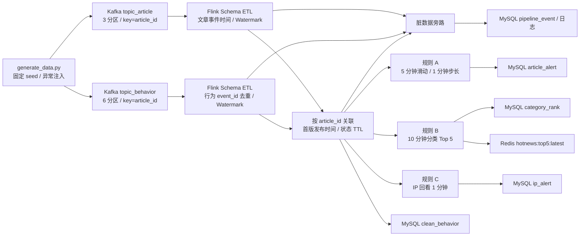

# 实时热点新闻检测系统

本项目按[《Flink 大数据 7 天学习目标与考核标准》](鲍献锐-Flink%20大数据%207%20天学习目标与考核标准.pdf)实现：从文章发布流和用户行为流识别热点文章、热门话题及疑似刷量 IP。本文将**已有代码、本地核验结果和待完成的线上验收**分开记录；有源码或离线基准不等于已经通过 Kafka、MySQL、Redis 和故障恢复验收。

## 架构与数据流



Kafka 缓冲突发流量并保留可回放的原始消息；两条 Topic 都按 `article_id` 作为消息 Key，便于关联和局部有序。文章 3 分区、行为 6 分区，作业默认并行度 3；行为流的分区数为后续扩容留出空间，但整体吞吐仍取决于最慢的算子、Sink 和资源配置。`event_time` 负责窗口与迟到判断，不能用处理时间代替。最小 Source 示例与实际 ETL/Join 作业是两个不同的入口。

| 目录 | 项目用途 |
| --- | --- |
| [`generator/`](generator/README.md) | 可复现的双流 JSONL/Kafka 数据、Schema 和生成报告 |
| [`flink-job/`](flink-job/pom.xml) | Source、双流 Join、规则 A/B/C、状态实验和外部 Sink |
| [`sql/`](sql/README.md) | MySQL 五张表、查询 SQL；独立规则基准 SQL 在 `tests/roles/` |
| [`deploy/`](deploy/README.md) | 本项目的 Compose、Flink 配置和 Topic 脚本 |
| [`tests/`](tests/README.md) | 固定数据、边界用例、独立 SQL 对照及本地性能实验 |
| [`docs/`](docs/README.md) | 架构/时间/状态/一致性/性能/故障/源码笔记和测试报告 |

## 输入字段与约束

完整约束见 [`article_stream.schema.json`](generator/schemas/article_stream.schema.json) 和 [`behavior_stream.schema.json`](generator/schemas/behavior_stream.schema.json)。下表是**合法主流**的必填字段；生成器按配置额外注入脏记录，不能把这些异常当成合法输入。

### `article_stream`：文章发布或更新

| 字段 | JSON 类型 | 必填 | 含义/校验 |
| --- | --- | --- | --- |
| `event_id` | string | 是 | 文章事件 ID |
| `event_type` | string | 是 | `publish` 或 `update` |
| `article_id` | string | 是 | 文章业务键和双流 Join Key |
| `title` | string | 是 | 非空，最长 200 字符 |
| `category` | string | 是 | 话题分类，用于规则 B |
| `tags` | array<string> | 是 | 1-10 个不重复标签 |
| `published_at` | string | 是 | ISO-8601 业务发布时间 |
| `event_time` | string | 是 | ISO-8601 事件时间，用于 Watermark |
| `ingest_time` | string | 是 | 模拟进入系统的时间，用于到达顺序 |
| `version` | integer | 是 | 版本号，至少为 1 |

```json
{"event_id":"article-event-00000001","event_type":"publish","article_id":"article-000001","title":"实时热点新闻示例","category":"technology","tags":["热点","实时"],"published_at":"2026-09-27T00:12:34.567Z","event_time":"2026-09-27T00:12:34.567Z","ingest_time":"2026-09-27T00:12:52.141Z","version":1}
```

### `behavior_stream`：点击、分享、评论

| 字段 | JSON 类型 | 必填 | 含义/校验 |
| --- | --- | --- | --- |
| `event_id` | string | 是 | 行为事件 ID，去重 Key |
| `user_id` | string | 是 | 用户 ID |
| `article_id` | string | 是 | 目标文章 ID；Join Key |
| `action` | string | 是 | `click`、`share`、`comment` |
| `ip` | string | 是 | IPv4 地址；规则 C 的 Key |
| `event_time` | string | 是 | ISO-8601 行为发生时间 |
| `ingest_time` | string | 是 | 模拟到达时间；生成器按此排序 |
| `read_duration_ms` | integer | 是 | 阅读时长，0-86400000 ms |

```json
{"event_id":"behavior-event-00000001","user_id":"user-000017","article_id":"article-000001","action":"click","ip":"10.1.2.3","event_time":"2026-09-27T00:13:05.042Z","ingest_time":"2026-09-27T00:13:21.781Z","read_duration_ms":1850}
```

`published_at` 是文章发布时间；`event_time` 是计算依据；`ingest_time` 是到达顺序模拟值。文章最初的 `version=1` 发布事件决定行为的有效时间下界，更新版不能取代这个下界。

## 数据生成与固定输入

在根目录使用 Python 运行（有 `py` 启动器时也可将 `python` 改为 `py`）：

```powershell
python generator\generate_data.py `
  --article-count 500 --behavior-count 100000 --rate 2000 `
  --seed 20260927 --disorder-min 5 --disorder-max 30 `
  --dirty-ratio 0.01 --duplicate-ratio 0.02 `
  --output json --output-dir generator\example-data
```

`--output json` 仅写 JSONL 和统计报告；`--output kafka` 写 Kafka，`--output both` 两者都写（Kafka 输出需安装 `kafka-python`）。固定验收文件已保存在 `generator/generator/data/`，**不要为查看结果重跑到该目录或对同一 Topic 重复发送**。同一 seed、参数和输出目录可以对照两次生成结果；`--rate` 控制发送/写出节奏，不是已经达到的持续处理吞吐。

[`generation_report.json`](generator/generator/data/generation_report.json)记录固定 seed 的 500 篇文章、100000 条行为、1000 条脏记录、2000 个重复事件；两篇热点文章占点击约 85.17%，两流到达覆盖至少 1 小时。异常包括空 `article_id`、负时长、未来时间，以及行为先于文章到达。报告的重复数是原始数据中的重复数；Schema 清洗后的重复口径以独立 SQL 基准为准。

## 应用程序：作用与实现思路

下表的“入口”可以独立运行；辅助类由相应作业调用，不应作为单独作业提交。Java 主类位于各模块的 `src/main/java/`，`--bounded` 仅用于隔离固定批次回放，持续模式不加此参数。

| 程序/模块 | 作用 | 实现思路及边界 |
| --- | --- | --- |
| [`generate_data.py`](generator/generate_data.py) | 生成文章、行为、统计报告；可发送 Kafka | 固定随机种子，按 `ingest_time` 排序，注入乱序、脏记录、重复、热点倾斜和跨流先后颠倒 |
| [`HotNewsKafkaSourceJob`](flink-job/flink-source/src/main/java/com/agd/flink/source/HotNewsKafkaSourceJob.java) | 独立 Kafka 连通性演示 | 两个 `KafkaSource<String>` 读取原始 JSON 文本，`noWatermarks()` 接丢弃 Sink；**不做** Schema 校验、Join、业务指标或外部写入 |
| [`ArticleJoinBehavior`](flink-job/flink-join/src/main/java/ArticleJoinBehavior.java) | 生产链路复用的双流 ETL/Join；可独立审计输出 | 先分别校验 Schema，行为按 `event_id` 去重，再分别分配 Watermark；按 `article_id` 保存文章及先到行为，首版发布后富化 `title/category/tags`，超期未配对留痕供回放 |
| [`Achieve_roleA`](flink-job/flink-rolesachieve/src/main/java/Achieve_roleA.java) | 热点文章告警 | 只取 `click`，文章键下计算 5 分钟滑动、1 分钟步长；点击数 **>1000** 输出文章、分类、次数、窗口起止和检测时间，晚到可修订 |
| [`Achieve_roleB`](flink-job/flink-rolesachieve/src/main/java/Achieve_roleB.java) | 十分钟热门分类 Top 5 | `click+share+comment` 先按分类/文章计数，再按窗口汇总、排序并输出每类前五文章 `top_articles[]`；修订时发整份榜单和 `revision` |
| [`Achieve_roleC`](flink-job/flink-rolesachieve/src/main/java/Achieve_roleC.java) | 疑似刷量 IP 告警 | 每次点击按 IP 回看上一分钟：不同文章 **>50** 且平均时长 **<2000 ms**；晚到可更新或撤销同一分钟告警 |
| [`ArticleHeatStateJob`](flink-job/flink-rolesachieve/src/main/java/ArticleHeatStateJob.java) | 第四天文章热点倾斜实验 | 原始模式沿用 A；`--optimized` 按事件 ID 把热点文章打散为 16 片后合并；独立保存最近热度快照 |
| [`IpWindowStateJob`](flink-job/flink-rolesachieve/src/main/java/IpWindowStateJob.java) | 第四天 IP 状态/倾斜实验 | 原始 1 片或优化 16 片，保存不同文章集合、点击数、总时长、窗口起止并合并；**一分钟不重叠窗口，不等于规则 C 的逐点击回看** |
| [`Day5SinkJob`](flink-job/flink-rolesachieve/src/main/java/Day5SinkJob.java) | 整合 Join、A/B/C 和外部结果 | 共用一次清洗后的流，分发到五类 MySQL 写入与 Redis 排名；配置 Checkpoint、重启策略；`--plan` 只生成执行图，不会写库 |
| [`Day5MySqlSink`](flink-job/flink-rolesachieve/src/main/java/Day5MySqlSink.java) | 写清洗明细、三类结果、异常事件 | 每 200 行或 Checkpoint 前 JDBC 批量提交；失败由 Flink 重试，表唯一键 + UPSERT 抵消重复写入，不做累加式更新 |
| [`Day5RedisRankSink`](flink-job/flink-rolesachieve/src/main/java/Day5RedisRankSink.java) | 写最新分类 Top 5 | 仅接收携带完整榜单的 rank=1，Lua 按窗口起点和修订号原子覆盖 `hotnews:top5:latest`，TTL 2 小时 |

辅助组件：[`FlinkSourceUtil`](flink-job/common/src/main/java/util/FlinkSourceUtil.java) 统一构造 Kafka Source、消费组和回放位点；[`RoleStreamUtil`](flink-job/flink-rolesachieve/src/main/java/RoleStreamUtil.java) 在规则入口二次防重并恢复事件时间。独立验证入口 [`tests/day2/verify.py`](tests/day2/verify.py) 用 SQLite 校验 Day 2 固定输入；[`tests/roles/verify.js`](tests/roles/verify.js) 加载原始 JSONL，运行 [`prepare.sql`](tests/roles/prepare.sql) 和 A/B/C 独立 SQL，并可与 Flink 日志逐窗口比对；[`Day4SkewBenchmark`](flink-job/flink-rolesachieve/src/test/java/Day4SkewBenchmark.java) 测原始/加盐两种路径的本地分布与时延。

## 时间、状态与异常处理

- 清洗后才取 `event_time`：文章乱序等待 30 秒，行为持续作业等待 65 分钟，隔离有界回放等待 2 小时；空闲分区 30 秒后不再拖住活跃分区的 Watermark。这些行为等待值用于处理实际跨分区到达跨度，不是生成器 5-30 秒乱序参数的同义词。
- Schema 解析失败或字段非法进入 `dirty_data` 日志旁路；跨流时序非法进入 `DIRTY_BEHAVIOR_ETL`。行为清洗后按 `event_id` 去重，处理时间 TTL 24 小时；超期后的同一 ID 不能承诺全局永久去重。
- Join 文章状态与首版发布时间状态处理时间 TTL 2 小时。行为先到时输出 `UNMATCHED_BEHAVIOR` 并暂存；文章到达后自动补 Join。等待期满或有界回放结束仍未解决，输出 `REPLAY_REQUIRED`，需保留原始 Kafka 消息作隔离回放；实际不存在的文章无法补齐。
- 超过 Join 30 秒允许迟到边界的记录输出 `LATE_DATA`，仍尝试时序 ETL/Join。A/B/C 可修正的事件时间状态在窗口结束后保留 24 小时，超过各自边界进入 `ROLE_*_LATE` 旁路，不等于已经在线补算。独立 Day 4 文章快照处理时间 TTL 为 24 小时，IP 实验状态 TTL 为 1 小时；TTL 不是 Watermark，也不保证立即物理回收。
- `Day5SinkJob` 的 `pipeline_event` 存 Join 未匹配、迟到、待回放及 A/B/C 超期事件；Schema 原文旁路、ETL 重复旁路目前主要打印到作业日志，**不是全部写入 MySQL**。需分别保存日志和查询表，不能声称所有异常都已持久化。

## 本项目运行命令

环境依赖：Python、Node.js（支持 `node:sqlite`）、Java 8/Maven；项目 Compose 的 Flink 镜像使用 Java 11。运行外部链路时还需 Docker Desktop 与 Kafka 生成器依赖 `kafka-python`。以下 PowerShell 命令均在项目根目录执行；`.env` 应由示例创建并修改口令，不能提交真实密码。

```powershell
# 先检查本项目配置，再启动所需服务和创建双 Topic。
if (-not (Test-Path deploy\.env)) { Copy-Item deploy\.env.example deploy\.env }
docker compose --env-file deploy\.env -f deploy\docker-compose.yml config
docker compose --env-file deploy\.env -f deploy\docker-compose.yml up -d
powershell -ExecutionPolicy Bypass -File deploy\create-kafka-topics.ps1

# 在隔离 Topic/空消费环境发送固定参数数据；不要向已有验收 Topic 重复发送。
python generator\generate_data.py --article-count 500 --behavior-count 100000 `
  --rate 2000 --seed 20260927 --disorder-min 5 --disorder-max 30 `
  --dirty-ratio 0.01 --duplicate-ratio 0.02 --output kafka `
  --kafka-bootstrap-servers localhost:9092

# 构建一体化作业；Compose 把 target 目录挂到 Flink 容器内。
mvn -f flink-job\pom.xml -pl flink-rolesachieve -am package
docker compose --env-file deploy\.env -f deploy\docker-compose.yml exec jobmanager `
  flink run -d -c Day5SinkJob /opt/flink/usrlib/flink-rolesachieve-1.0-SNAPSHOT-all.jar

# 查询作业、MySQL 核验 SQL 和 Redis 榜单；Checkpoint 指标见 Web UI。
docker compose --env-file deploy\.env -f deploy\docker-compose.yml exec jobmanager flink list
Get-Content sql\queries\day5-check.sql -Raw | docker compose --env-file deploy\.env `
  -f deploy\docker-compose.yml exec -T mysql `
  sh -c 'MYSQL_PWD="$MYSQL_ROOT_PASSWORD" mysql -uroot hotnews'
docker compose --env-file deploy\.env -f deploy\docker-compose.yml exec redis `
  redis-cli HGETALL hotnews:top5:latest
docker compose --env-file deploy\.env -f deploy\docker-compose.yml exec redis `
  redis-cli TTL hotnews:top5:latest
```

Flink Web UI：Docker `http://localhost:8081`；本地 Source 演示 `http://localhost:8082`。宿主机程序连接 Kafka 用 `localhost:9092`，容器内作业通过 Compose 环境变量连接 `kafka:29092`。Compose 中 Checkpoint/Savepoint 绑定目录是 `D:\docker_data\flink\checkpoints` / `D:\docker_data\flink\savepoints`，换机需先修改绑定路径。MySQL 的初始化脚本只在**新数据目录**第一次启动时执行；已有数据卷需要手动应用 [`01-day5-tables.sql`](sql/01-day5-tables.sql)，不要通过删卷来加载新表。

**当前部署待核验：**[`docker-compose.yml`](deploy/docker-compose.yml) 的 `taskmanager.volumes` 重复挂载了同一份 `flink-conf.yaml`；提交前应检查该条目，并以 `docker compose ... config` 和实际启动结果为准。当前环境未运行 Docker，因此以上命令是项目操作步骤，**不是**启动成功的证据。更详细的外部存储核验及故障演练步骤见 [`Day 5 恢复验收`](docs/04-Day5-Sink与恢复验收.md)。根 README 不收录 Docker 通用概念、镜像下载教程或清空数据卷的命令。

## 对照测试与考核证据

```powershell
# 独立离线基准：从原始 JSONL 生成逐窗口结果，不读取 Flink 输出。
node --no-warnings tests\roles\verify.js
node --no-warnings --test tests\roles\baseline.test.js
python tests\day2\verify.py

# Java 边界及 Sink 合约测试；第四天倾斜基准需单独显式运行。
mvn -o -f flink-job\pom.xml -pl flink-rolesachieve -am test
mvn -o -f flink-job\pom.xml -pl flink-rolesachieve -am `
  '-Dtest=Day4SkewBenchmark' '-Dsurefire.failIfNoSpecifiedTests=false' `
  '-Dday4.backend=hashmap' test

# 取得一次隔离批次的 Flink UTF-8 日志后，逐窗口核对（示例：规则 B）。
node --no-warnings tests\roles\verify.js --role b --flink-log tests\roles\role-b-snapshot-20261005.log
```

固定输入的独立 SQL 口径：500 篇有效文章、99000 条 Schema 合法行为，其中 1956 条重复 `event_id`；去重后可 Join 的行为为 **97044**。A 最终 **123** 行、B 最终 **60** 行、C **0** 行。保留的有界回放日志 [`Join`](tests/roles/join-etl-dedup-20261005.log)、[`A`](tests/roles/role-a-etl-dedup-20261005.log)、[`B 完整快照`](tests/roles/role-b-snapshot-20261005.log)、[`C`](tests/roles/role-c-etl-dedup-20261005.log)用于对照；C=0 只能说明该大样本无告警，其 49/50/51 篇、1999/2000 ms 和迟到撤销正例由 [`RoleRulesTest`](flink-job/flink-rolesachieve/src/test/java/RoleRulesTest.java)验证。未关闭的持续流窗口不能和完整有界基准直接比较。

| PDF 考核项 | 本仓库证据及当前状态 |
| --- | --- |
| Day 1：字段、架构、生成器 | 本文 Schema/示例/架构；固定 [`generation_report.json`](generator/generator/data/generation_report.json) 与生成器；重复运行应在**新目录**核对文件一致性 |
| Day 2：Watermark、脏数据、Join、补算 | `ArticleJoinBehavior`、[`tests/day2/`](tests/day2/README.md) 离线基准及边界输入；在线空闲分区/迟到完整回放日志仍需补足 |
| Day 3：A/B 窗口、阈值、独立基准 | [`tests/roles/`](tests/roles/README.md) 中逐窗口 SQL、回放日志及 Java 边界测试 |
| Day 4：C、去重、TTL、热点倾斜 | [`状态与内存笔记`](docs/03-状态TTL与内存模型笔记.md)、[`Day 4 实验`](tests/day4/README.md) 与本地结果；RocksDB/集群资源对照尚未实测 |
| Day 5：MySQL/Redis、Checkpoint、恢复 | Sink/表结构/配置与本地合约测试已写；**MySQL/Redis 实写、Kill TaskManager、Savepoint 尚未实测**，按 [`验收步骤`](docs/04-Day5-Sink与恢复验收.md) 补证据 |
| Day 6：2000/5000 events/s、反压、容量 | 有本地倾斜探针吞吐和 p95，但探针 p95 **不是**端到端延迟；持续 2000/5000、Kafka Lag、Sink 反压及内存指标缺实际集群报告 |
| Day 7：空环境、故障、回归 | 文档和恢复 SOP 位于 [`docs/`](docs/README.md)；空环境完整运行、至少两类现场故障、截图及恢复后逐表核对尚待执行 |

第四天的本地数据为每组 12000 条、90% 热点、并行度 3，两轮对照显示加盐改善 Subtask 分布且结果一致，但吞吐没有稳定提升；不能据此宣称满足 PDF 的持续 **2000 events/s** 或性能评分。结果和测量定义见 [`tests/day4/README.md`](tests/day4/README.md)。

**与 PDF 的已知差距：**规则 C 主作业输出有 `article_count`、`click_count`、平均时长和窗口时间，但**没有**考核示例要求的 `article_ids[]`；该字段仅出现在语义不同的 `IpWindowStateJob`，不可冒充规则 C 的输出。当前也没有可查询结果的 API/看板。补齐前不得声称这两项已交付。

## Checkpoint 与一致性边界

`Day5SinkJob` 设置 Checkpoint 间隔 10 秒、超时 60 秒、最小间隔 2 秒、最多 1 个并发、容忍 3 次连续失败，取消作业时保留外部 Checkpoint，失败后固定延迟重启最多 3 次。10 秒间隔对应小批量写入与恢复频率的折中，60 秒超时及最小间隔用于给慢 Sink/反压留出余量；实际是否合适需要现场记录 Barrier 对齐、Checkpoint 耗时和失败原因。Savepoint 用于受控停止/升级；不能随意更换状态描述符、序列化格式和算子拓扑。

```text
Kafka 消费 -> Flink 去重/Join/规则状态 -> MySQL 批量 UPSERT / Redis 原子榜单
                           -> Sink 在 Checkpoint 前 flush -> 状态及 Kafka 位点快照
故障恢复 <- 从最近一次成功快照恢复状态/位点 <- 重放未确认事件
                           -> MySQL 唯一键覆盖 / Redis 拒绝旧窗口及旧修订号
```

Checkpoint 保证 **Flink 状态和 Kafka 位点**的一致恢复；MySQL/Redis 并未加入同一个分布式事务。外部结果是**至少一次写入 + 幂等最终收敛**，不是跨 MySQL 与 Redis 的原子 Exactly-Once。MySQL 用事件 ID、窗口与文章、窗口与名次、告警分钟与 IP 等唯一键；Redis 保存完整快照并拒绝更旧的窗口/修订号。故障重放期间，多张表也不保证同一瞬间一致，待消费追平后再以 [`day5-check.sql`](sql/queries/day5-check.sql)核验；异常旁路中的超期数据需另行离线补算。

考核 PDF 的提交截止日期为 **2026 年 10 月 6 日**。最终提交 ID：**待实际推送后填写**。最终推送、版本标签 `v1.0-final`、监控截图和故障/压测原始证据需在实际完成后记录，不以本地文件或待执行命令代替最终验收。
